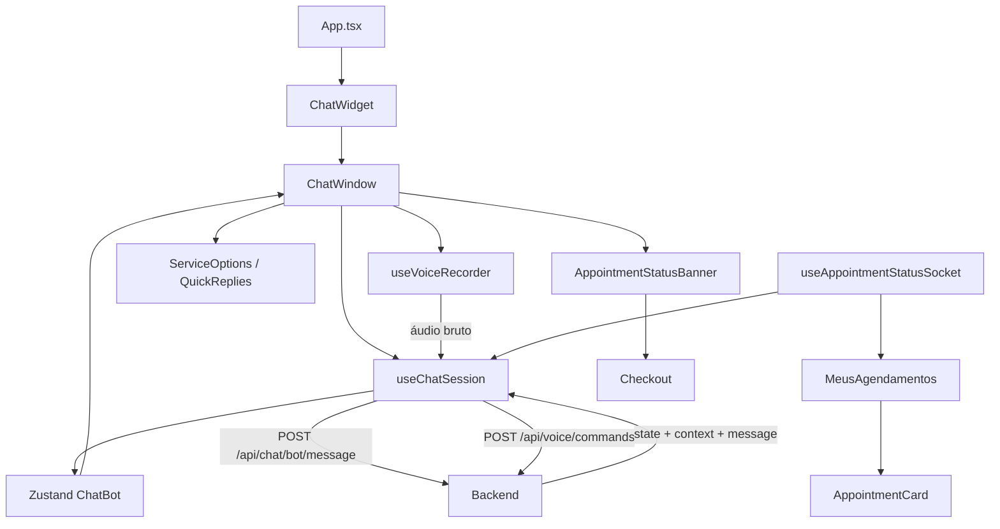

# Chatbot DelBicos — inventário técnico do frontend

## 1. Finalidade

Este documento registra os arquivos do chatbot no repositório `DelBicosV2`,
frontend React Native compartilhado por web e mobile.

O histórico Git mostra duas fases:

1. criação da interface, store e comunicação inicial do chatbot;
2. adequação para o backend PLN determinístico, regras expandidas, reinício de
   sessão e atualização automática de aceite/pagamento.

A interface existente não foi recriada em HTML. Os componentes React Native
originais foram preservados e ampliados.

## 2. Arquivos criados para a base visual e funcional

### 2.1 Estado e comunicação

| Arquivo | Responsabilidade |
| --- | --- |
| `src/stores/ChatBot/ChatBot.ts` | Store Zustand: sessão, mensagens, loading, erro, estado, contexto e limpeza. Persiste apenas `sessionId` no AsyncStorage. |
| `src/stores/ChatBot/types.ts` | Contratos TypeScript de mensagens, estados, contexto, ações, serviços, respostas HTTP e histórico. |
| `src/stores/ChatBot/index.ts` | Exportação pública da store e dos tipos. |
| `src/hooks/useChatSession.ts` | Orquestra chamadas HTTP, restauração, envio, quick replies, reinício, erros e atualização de status no chat. |
| `src/hooks/useVoiceRecorder.ts` | Solicita microfone e grava áudio com API compartilhada para web, Android e iOS. |

### 2.2 Ponto de entrada

| Arquivo | Responsabilidade |
| --- | --- |
| `src/components/features/ChatBot/ChatWidget/ChatWidget.tsx` | Botão flutuante e painel. Na web funciona como drawer lateral; no mobile, como modal de tela cheia. |
| `src/components/features/ChatBot/ChatWidget/styles.ts` | Estilos responsivos do botão e painel. |
| `src/components/features/ChatBot/ChatWidget/index.ts` | Exportação do widget. |
| `src/screens/private/chatbot/ChatBotScreen.tsx` | Versão do chatbot como tela de navegação completa. |

### 2.3 Janela e componentes internos

| Arquivo | Responsabilidade |
| --- | --- |
| `src/components/features/ChatBot/ChatWindow/ChatWindow.tsx` | Componente coordenador: histórico, entrada, opções, cartões, banners, modal e hooks. |
| `src/components/features/ChatBot/ChatWindow/styles.ts` | Layout da janela, lista, banners e espaçamentos. |
| `src/components/features/ChatBot/ChatWindow/index.ts` | Exportação da janela. |
| `src/components/features/ChatBot/ChatWindow/MessageBubble/MessageBubble.tsx` | Renderiza balões do cliente/bot e cartões associados a ações. |
| `src/components/features/ChatBot/ChatWindow/MessageBubble/index.ts` | Exportação do balão. |
| `src/components/features/ChatBot/ChatWindow/ChatHeader/ChatHeader.tsx` | Cabeçalho com nome, reiniciar e fechar/minimizar. |
| `src/components/features/ChatBot/ChatWindow/ChatHeader/index.ts` | Exportação do cabeçalho. |
| `src/components/features/ChatBot/ChatWindow/ChatInputBar/ChatInputBar.tsx` | Campo de texto, envio, loading e bloqueio por rate limit. |
| `src/components/features/ChatBot/ChatWindow/ChatInputBar/index.ts` | Exportação da entrada. |
| `src/components/features/ChatBot/ChatWindow/ChatErrorBanner/ChatErrorBanner.tsx` | Exibe erro recuperável e opção de tentar novamente. |
| `src/components/features/ChatBot/ChatWindow/ChatErrorBanner/index.ts` | Exportação do banner de erro. |
| `src/components/features/ChatBot/ChatWindow/AppointmentStatusBanner/AppointmentStatusBanner.tsx` | Exibe espera, pagamento pendente, pago ou cancelado; navega ao checkout/agenda. |
| `src/components/features/ChatBot/ChatWindow/AppointmentStatusBanner/index.ts` | Exportação do banner de status. |
| `src/components/features/ChatBot/ChatWindow/hooks/useRateLimitCountdown.ts` | Calcula o tempo restante após HTTP 429. |
| `src/components/features/ChatBot/ChatWindow/hooks/useAppointmentPolling.ts` | Acompanha aceite/pagamento por socket e polling de contingência. |

### 2.4 Interações e cartões

| Arquivo | Responsabilidade |
| --- | --- |
| `src/components/features/ChatBot/QuickReplies/QuickReplies.tsx` | Renderiza chips como “Sim”, “Não” e horários sugeridos. |
| `src/components/features/ChatBot/QuickReplies/styles.ts` | Estilos dos chips. |
| `src/components/features/ChatBot/QuickReplies/index.ts` | Exportação dos quick replies. |
| `src/components/features/ChatBot/TypingIndicator/TypingIndicator.tsx` | Indicador visual enquanto o backend responde. |
| `src/components/features/ChatBot/TypingIndicator/styles.ts` | Animação e estilos do indicador. |
| `src/components/features/ChatBot/TypingIndicator/index.ts` | Exportação do indicador. |
| `src/components/features/ChatBot/ChatBotAppointmentCard/ChatBotAppointmentCard.tsx` | Cartão de agendamento dentro da conversa, com ações como cancelar/reagendar. |
| `src/components/features/ChatBot/ChatBotAppointmentCard/styles.ts` | Estilos do cartão. |
| `src/components/features/ChatBot/ChatBotAppointmentCard/index.ts` | Exportação do cartão. |

## 3. Arquivos criados na adequação atual

| Arquivo | Motivo da criação |
| --- | --- |
| `src/components/features/ChatBot/ServiceOptions/ServiceOptions.tsx` | Exibe os profissionais retornados pelo backend com serviço, avaliação, preço, duração, local e botão de escolha. |
| `src/components/features/ChatBot/ServiceOptions/styles.ts` | Estilos responsivos dos cartões de profissionais. |
| `src/components/features/ChatBot/ServiceOptions/index.ts` | Exportação do componente. |
| `src/hooks/useAppointmentStatusSocket.ts` | Mantém uma conexão Socket.IO autenticada e compartilhada para receber `appointment:status`. |
| `docs/CHATBOT_INVENTARIO_FRONTEND.md` | Este inventário técnico. |

O `ServiceOptions` foi criado para reutilizar o visual React Native já existente,
sem criar uma segunda interface HTML para o chatbot.

## 4. Arquivos alterados na adequação atual

### 4.1 Sessão, histórico e protocolo

| Arquivo alterado | Alteração |
| --- | --- |
| `src/hooks/useChatSession.ts` | Passa timezone, interpreta `clear_history`, restaura sessão autorizada, aplica eventos de aceite/pagamento e evita mensagens duplicadas. |
| `src/stores/ChatBot/types.ts` | Adiciona `AGUARDANDO_CONFIRMACAO`, dados de serviço/profissional/data, status do agendamento e pagamento. |
| `src/stores/ChatBot/ChatBot.ts` | Adiciona limpeza completa da sessão sem manter mensagens antigas após reinício. |

### 4.2 Janela do chatbot

| Arquivo alterado | Alteração |
| --- | --- |
| `src/components/features/ChatBot/ChatWindow/ChatWindow.tsx` | Mantém a composição visual existente, integra opções de serviço, polling/socket, banner de agendamento e passa o fechamento ao botão Pagar. |
| `src/components/features/ChatBot/ChatWindow/ChatHeader/ChatHeader.tsx` | O botão reiniciar chama o backend e limpa a sessão somente após a resposta. |
| `src/components/features/ChatBot/ChatWindow/AppointmentStatusBanner/AppointmentStatusBanner.tsx` | Exibe status em qualquer sessão vinculada, converte data/hora para ISO, fecha o chat e abre checkout. |
| `src/components/features/ChatBot/ChatWindow/hooks/useAppointmentPolling.ts` | Substitui a consulta genérica incorreta pelo endpoint autorizado do bot; usa socket como caminho principal e polling como fallback. |

### 4.3 Agenda e pagamento pendente

| Arquivo alterado | Alteração |
| --- | --- |
| `src/components/features/AppointmentCard/AppointmentCard.tsx` | Diferencia visão do cliente/profissional, exibe **Pagamento pendente** e mantém o botão **Pagar** no cartão confirmado sem `payment_intent_id`. |
| `src/screens/private/client/Profile/Tabs/MeusAgendamentos/MeusAgendamentos.tsx` | Escuta `appointment:status` e recarrega a agenda imediatamente, mantendo polling periódico existente. |

### 4.4 Integração global

| Arquivo alterado quando o chatbot foi introduzido | Função |
| --- | --- |
| `src/App.tsx` | Monta o `ChatWidget` para usuários autenticados, permitindo uso sobre as telas da aplicação. |
| `src/screens/NavigationStack.tsx` | Registra a rota `ChatBot` e liga a tela dedicada à navegação web/mobile. |

## 5. Fluxo entre os arquivos

## 6. Funcionamento de `useChatSession`

O hook é a camada de aplicação do chatbot no frontend.

### Ao abrir

1. chama `GET /api/chat/bot/session/active`;
2. normaliza mensagens antigas e atuais;
3. salva `sessionId`, estado e contexto;
4. o `ChatWindow` renderiza o resultado.

### Ao enviar

1. cria uma bolha otimista do usuário;
2. envia texto, sessão, canal, timezone e horário selecionado;
3. recebe a resposta;
4. atualiza estado/contexto;
5. deriva opções rápidas e horários;
6. cria a bolha do bot;
7. trata 401, 404, 429 e erros genéricos.

### Por voz

1. o usuário toca no ícone de microfone; o navegador ou aplicativo solicita a
   permissão do sistema;
2. `useVoiceRecorder` grava WebM no navegador e AAC/M4A no mobile;
3. ao tocar novamente, o frontend envia o áudio bruto para
   `POST /api/voice/commands`, com JWT, idioma, timezone, sessão e chave de
   idempotência nos headers;
4. o backend transcreve e encaminha a frase para a mesma máquina de conversa
   usada pelo texto, incluindo a busca semântica de serviços;
5. o frontend mostra a transcrição como bolha do usuário e reutiliza os
   mesmos cartões de serviço, profissionais, horários e confirmações;
6. falhas de permissão, áudio curto, formato não aceito, áudio longo, rate
   limit e transcrição sem compreensão recebem mensagens próprias.
7. a gravação é encerrada automaticamente após 60 segundos para limitar o
   tamanho do envio; falhas transitórias podem ser reenviadas com a mesma
   chave de idempotência, sem duplicar o comando.

Não há chave da Groq, nem de qualquer outro provedor, no aplicativo. A chave
fica exclusivamente no backend.

### Busca semântica de serviços

As buscas digitadas no cabeçalho e na tela inicial encaminham a frase para
`GET /api/services/search/semantic`. A tela de resultado exibe os serviços
ordenados pela relevância recebida do backend, preservando os cartões já usados
no catálogo. Assim, texto e voz consultam a mesma base semântica, mas somente
o backend decide a relevância e os dados retornados.

### Ao reiniciar

1. envia `reiniciar` sem mostrar o comando como bolha;
2. aguarda `clear_history: true`;
3. executa `clearSession`;
4. guarda o novo `session_id`;
5. exibe somente a resposta da nova conversa.

## 7. Funcionamento do socket compartilhado

`useAppointmentStatusSocket` usa o token da store de usuário e conecta ao mesmo
servidor Socket.IO do backend. Os componentes inscritos compartilham uma única
conexão por token.

Consumidores atuais:

- chatbot: adiciona a confirmação e atualiza o banner;
- agenda: chama `fetchAppointments` imediatamente.

Ao desmontar o último consumidor, o socket é fechado. Isso evita conexões
duplicadas quando o chatbot está aberto sobre a tela da agenda.

## 8. Pagamento pelo chatbot

Quando o status é `confirmed` e `paid` é falso:

1. o banner apresenta **Pagar**;
2. combina `date/newDate` com `time/newTime`;
3. converte a data/hora local para ISO UTC;
4. executa `onClose` para minimizar o chat;
5. navega ao checkout com `appointmentId`, serviço e profissional;
6. o checkout permanece visível sem o painel sobreposto.

O cartão da agenda utiliza diretamente `appointment.start_time`, pois já recebe
o agendamento completo da API.

## 9. O que o frontend não faz

O frontend não:

- treina TF-IDF ou SVM;
- decide qual intenção foi identificada;
- interpreta calendário como fonte de verdade;
- cria agendamento diretamente no estado local;
- confirma pagamento sem o backend/Stripe;
- aceita agendamento em nome de outro profissional;
- depende de HTML separado para web.

Toda regra crítica é confirmada no backend.

## 10. Compatibilidade web e mobile

- os componentes utilizam React Native;
- `Platform.OS` diferencia drawer web, modal mobile e fallback de navegação;
- `expo-audio` usa `MediaRecorder` na web e o gravador nativo no Android/iOS;
- o Android declara `RECORD_AUDIO` e o iOS apresenta uma justificativa em
  português antes de liberar o microfone;
- no desenvolvimento, o emulador Android usa `10.0.2.2` e o simulador iOS usa
  `localhost`; um dispositivo físico deve apontar para o IP da rede local ou
  para uma API publicada em HTTPS;
- `AsyncStorage` guarda apenas o identificador da sessão;
- timezone é obtido com `Intl.DateTimeFormat`;
- a mesma API e o mesmo Socket.IO são usados nas duas plataformas;
- links web e deep links mobile são usados apenas como contingência quando a
  referência de navegação ainda não está pronta.

## 11. Dependências utilizadas

| Dependência | Uso |
| --- | --- |
| React/React Native | Componentes e hooks. |
| Zustand | Estado da sessão do chatbot. |
| expo-zustand-persist + AsyncStorage | Persistência mínima do `sessionId`. |
| Axios/cliente HTTP existente | Chamadas autenticadas ao backend. |
| expo-audio | Permissão e gravação de voz no navegador, Android e iOS. |
| socket.io-client | Atualização em tempo real. |
| React Navigation | Chatbot como tela e navegação ao checkout/agenda. |
| Expo Vector Icons | Ícones do widget, mensagens, status e cartões. |

## 12. Relação com outras funcionalidades

As alterações de frontend ficaram limitadas a:

- componentes e store do chatbot;
- cartão de agendamento;
- tela de agenda do cliente;
- navegação ao checkout.

GPS, mapas, raio de atendimento, cadastro e telas administrativas não foram
alterados pela adequação do PLN.

## 13. Documentação complementar

No backend:

- `docs/DOCUMENTACAO_TECNICA_PLN_CHATBOT.md` — seção acadêmica da feature;
- `docs/CHATBOT_FLUXO_COMPLETO.md` — arquitetura e fluxo ponta a ponta;
- `docs/CHATBOT_PLN.md` — decisão técnica e regras de linguagem;
- `docs/CHATBOT_INVENTARIO_BACKEND.md` — inventário do backend.
