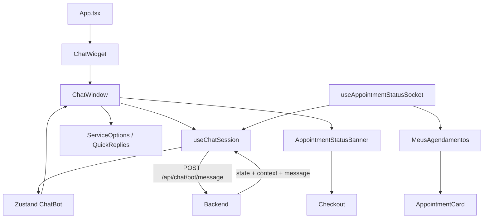

# Chatbot DelBicos — visão, requisitos, inventário técnico e plano de entregas

## 1. Finalidade

Este documento registra os arquivos do chatbot no repositório `DelBicosV2`,
frontend React Native compartilhado por web e mobile.

O histórico Git mostra duas fases:

1. criação da interface, store e comunicação inicial do chatbot;
2. adequação para o backend PLN determinístico, regras expandidas, reinício de
   sessão e atualização automática de aceite/pagamento.

A interface existente não foi recriada em HTML. Os componentes React Native
originais foram preservados e ampliados.

## 2. Arquivos criados para a base visual e funcional

### 2.1 Estado e comunicação

| Arquivo | Responsabilidade |
| --- | --- |
| `src/stores/ChatBot/ChatBot.ts` | Store Zustand: sessão, mensagens, loading, erro, estado, contexto e limpeza. Persiste apenas `sessionId` no AsyncStorage. |
| `src/stores/ChatBot/types.ts` | Contratos TypeScript de mensagens, estados, contexto, ações, serviços, respostas HTTP e histórico. |
| `src/stores/ChatBot/index.ts` | Exportação pública da store e dos tipos. |
| `src/hooks/useChatSession.ts` | Orquestra chamadas HTTP, restauração, envio, quick replies, reinício, erros e atualização de status no chat. |

### 2.2 Ponto de entrada

| Arquivo | Responsabilidade |
| --- | --- |
| `src/components/features/ChatBot/ChatWidget/ChatWidget.tsx` | Botão flutuante e painel. Na web funciona como drawer lateral; no mobile, como modal de tela cheia. |
| `src/components/features/ChatBot/ChatWidget/styles.ts` | Estilos responsivos do botão e painel. |
| `src/components/features/ChatBot/ChatWidget/index.ts` | Exportação do widget. |
| `src/screens/private/chatbot/ChatBotScreen.tsx` | Versão do chatbot como tela de navegação completa. |

### 2.3 Janela e componentes internos

| Arquivo | Responsabilidade |
| --- | --- |
| `src/components/features/ChatBot/ChatWindow/ChatWindow.tsx` | Componente coordenador: histórico, entrada, opções, cartões, banners, modal e hooks. |
| `src/components/features/ChatBot/ChatWindow/styles.ts` | Layout da janela, lista, banners e espaçamentos. |
| `src/components/features/ChatBot/ChatWindow/index.ts` | Exportação da janela. |
| `src/components/features/ChatBot/ChatWindow/MessageBubble/MessageBubble.tsx` | Renderiza balões do cliente/bot e cartões associados a ações. |
| `src/components/features/ChatBot/ChatWindow/MessageBubble/index.ts` | Exportação do balão. |
| `src/components/features/ChatBot/ChatWindow/ChatHeader/ChatHeader.tsx` | Cabeçalho com nome, reiniciar e fechar/minimizar. |
| `src/components/features/ChatBot/ChatWindow/ChatHeader/index.ts` | Exportação do cabeçalho. |
| `src/components/features/ChatBot/ChatWindow/ChatInputBar/ChatInputBar.tsx` | Campo de texto, envio, loading e bloqueio por rate limit. |
| `src/components/features/ChatBot/ChatWindow/ChatInputBar/index.ts` | Exportação da entrada. |
| `src/components/features/ChatBot/ChatWindow/ChatErrorBanner/ChatErrorBanner.tsx` | Exibe erro recuperável e opção de tentar novamente. |
| `src/components/features/ChatBot/ChatWindow/ChatErrorBanner/index.ts` | Exportação do banner de erro. |
| `src/components/features/ChatBot/ChatWindow/AppointmentStatusBanner/AppointmentStatusBanner.tsx` | Exibe espera, pagamento pendente, pago ou cancelado; navega ao checkout/agenda. |
| `src/components/features/ChatBot/ChatWindow/AppointmentStatusBanner/index.ts` | Exportação do banner de status. |
| `src/components/features/ChatBot/ChatWindow/hooks/useRateLimitCountdown.ts` | Calcula o tempo restante após HTTP 429. |
| `src/components/features/ChatBot/ChatWindow/hooks/useAppointmentPolling.ts` | Acompanha aceite/pagamento por socket e polling de contingência. |

### 2.4 Interações e cartões

| Arquivo | Responsabilidade |
| --- | --- |
| `src/components/features/ChatBot/QuickReplies/QuickReplies.tsx` | Renderiza chips como “Sim”, “Não” e horários sugeridos. |
| `src/components/features/ChatBot/QuickReplies/styles.ts` | Estilos dos chips. |
| `src/components/features/ChatBot/QuickReplies/index.ts` | Exportação dos quick replies. |
| `src/components/features/ChatBot/TypingIndicator/TypingIndicator.tsx` | Indicador visual enquanto o backend responde. |
| `src/components/features/ChatBot/TypingIndicator/styles.ts` | Animação e estilos do indicador. |
| `src/components/features/ChatBot/TypingIndicator/index.ts` | Exportação do indicador. |
| `src/components/features/ChatBot/ChatBotAppointmentCard/ChatBotAppointmentCard.tsx` | Cartão de agendamento dentro da conversa, com ações como cancelar/reagendar. |
| `src/components/features/ChatBot/ChatBotAppointmentCard/styles.ts` | Estilos do cartão. |
| `src/components/features/ChatBot/ChatBotAppointmentCard/index.ts` | Exportação do cartão. |

## 3. Arquivos criados na adequação atual

| Arquivo | Motivo da criação |
| --- | --- |
| `src/components/features/ChatBot/ServiceOptions/ServiceOptions.tsx` | Exibe os profissionais retornados pelo backend com serviço, avaliação, preço, duração, local e botão de escolha. |
| `src/components/features/ChatBot/ServiceOptions/styles.ts` | Estilos responsivos dos cartões de profissionais. |
| `src/components/features/ChatBot/ServiceOptions/index.ts` | Exportação do componente. |
| `src/hooks/useAppointmentStatusSocket.ts` | Mantém uma conexão Socket.IO autenticada e compartilhada para receber `appointment:status`. |
| `docs/CHATBOT_INVENTARIO_FRONTEND.md` | Este inventário técnico. |

O `ServiceOptions` foi criado para reutilizar o visual React Native já existente,
sem criar uma segunda interface HTML para o chatbot.

## 4. Arquivos alterados na adequação atual

### 4.1 Sessão, histórico e protocolo

| Arquivo alterado | Alteração |
| --- | --- |
| `src/hooks/useChatSession.ts` | Passa timezone, interpreta `clear_history`, restaura sessão autorizada, aplica eventos de aceite/pagamento e evita mensagens duplicadas. |
| `src/stores/ChatBot/types.ts` | Adiciona `AGUARDANDO_CONFIRMACAO`, dados de serviço/profissional/data, status do agendamento e pagamento. |
| `src/stores/ChatBot/ChatBot.ts` | Adiciona limpeza completa da sessão sem manter mensagens antigas após reinício. |

### 4.2 Janela do chatbot

| Arquivo alterado | Alteração |
| --- | --- |
| `src/components/features/ChatBot/ChatWindow/ChatWindow.tsx` | Mantém a composição visual existente, integra opções de serviço, polling/socket, banner de agendamento e passa o fechamento ao botão Pagar. |
| `src/components/features/ChatBot/ChatWindow/ChatHeader/ChatHeader.tsx` | O botão reiniciar chama o backend e limpa a sessão somente após a resposta. |
| `src/components/features/ChatBot/ChatWindow/AppointmentStatusBanner/AppointmentStatusBanner.tsx` | Exibe status em qualquer sessão vinculada, converte data/hora para ISO, fecha o chat e abre checkout. |
| `src/components/features/ChatBot/ChatWindow/hooks/useAppointmentPolling.ts` | Substitui a consulta genérica incorreta pelo endpoint autorizado do bot; usa socket como caminho principal e polling como fallback. |

### 4.3 Agenda e pagamento pendente

| Arquivo alterado | Alteração |
| --- | --- |
| `src/components/features/AppointmentCard/AppointmentCard.tsx` | Diferencia visão do cliente/profissional, exibe **Pagamento pendente** e mantém o botão **Pagar** no cartão confirmado sem `payment_intent_id`. |
| `src/screens/private/client/Profile/Tabs/MeusAgendamentos/MeusAgendamentos.tsx` | Escuta `appointment:status` e recarrega a agenda imediatamente, mantendo polling periódico existente. |

### 4.4 Integração global

| Arquivo alterado quando o chatbot foi introduzido | Função |
| --- | --- |
| `src/App.tsx` | Monta o `ChatWidget` para usuários autenticados, permitindo uso sobre as telas da aplicação. |
| `src/screens/NavigationStack.tsx` | Registra a rota `ChatBot` e liga a tela dedicada à navegação web/mobile. |

## 5. Fluxo entre os arquivos



## 6. Funcionamento de `useChatSession`

O hook é a camada de aplicação do chatbot no frontend.

### Ao abrir

1. chama `GET /api/chat/bot/session/active`;
2. normaliza mensagens antigas e atuais;
3. salva `sessionId`, estado e contexto;
4. o `ChatWindow` renderiza o resultado.

### Ao enviar

1. cria uma bolha otimista do usuário;
2. envia texto, sessão, canal, timezone e horário selecionado;
3. recebe a resposta;
4. atualiza estado/contexto;
5. deriva opções rápidas e horários;
6. cria a bolha do bot;
7. trata 401, 404, 429 e erros genéricos.

### Ao reiniciar

1. envia `reiniciar` sem mostrar o comando como bolha;
2. aguarda `clear_history: true`;
3. executa `clearSession`;
4. guarda o novo `session_id`;
5. exibe somente a resposta da nova conversa.

## 7. Funcionamento do socket compartilhado

`useAppointmentStatusSocket` usa o token da store de usuário e conecta ao mesmo
servidor Socket.IO do backend. Os componentes inscritos compartilham uma única
conexão por token.

Consumidores atuais:

- chatbot: adiciona a confirmação e atualiza o banner;
- agenda: chama `fetchAppointments` imediatamente.

Ao desmontar o último consumidor, o socket é fechado. Isso evita conexões
duplicadas quando o chatbot está aberto sobre a tela da agenda.

## 8. Pagamento pelo chatbot

Quando o status é `confirmed` e `paid` é falso:

1. o banner apresenta **Pagar**;
2. combina `date/newDate` com `time/newTime`;
3. converte a data/hora local para ISO UTC;
4. executa `onClose` para minimizar o chat;
5. navega ao checkout com `appointmentId`, serviço e profissional;
6. o checkout permanece visível sem o painel sobreposto.

O cartão da agenda utiliza diretamente `appointment.start_time`, pois já recebe
o agendamento completo da API.

## 9. O que o frontend não faz

O frontend não:

- treina TF-IDF ou SVM;
- decide qual intenção foi identificada;
- interpreta calendário como fonte de verdade;
- cria agendamento diretamente no estado local;
- confirma pagamento sem o backend/Stripe;
- aceita agendamento em nome de outro profissional;
- depende de HTML separado para web.

Toda regra crítica é confirmada no backend.

## 10. Compatibilidade web e mobile

- os componentes utilizam React Native;
- `Platform.OS` diferencia drawer web, modal mobile e fallback de navegação;
- `AsyncStorage` guarda apenas o identificador da sessão;
- timezone é obtido com `Intl.DateTimeFormat`;
- a mesma API e o mesmo Socket.IO são usados nas duas plataformas;
- links web e deep links mobile são usados apenas como contingência quando a
  referência de navegação ainda não está pronta.

## 11. Dependências utilizadas

| Dependência | Uso |
| --- | --- |
| React/React Native | Componentes e hooks. |
| Zustand | Estado da sessão do chatbot. |
| expo-zustand-persist + AsyncStorage | Persistência mínima do `sessionId`. |
| Axios/cliente HTTP existente | Chamadas autenticadas ao backend. |
| socket.io-client | Atualização em tempo real. |
| React Navigation | Chatbot como tela e navegação ao checkout/agenda. |
| Expo Vector Icons | Ícones do widget, mensagens, status e cartões. |

## 12. Relação com outras funcionalidades

As alterações de frontend ficaram limitadas a:

- componentes e store do chatbot;
- cartão de agendamento;
- tela de agenda do cliente;
- navegação ao checkout.

GPS, mapas, raio de atendimento, cadastro e telas administrativas não foram
alterados pela adequação do PLN.

## 13. Documentação complementar

No backend:

- `docs/DOCUMENTACAO_TECNICA_PLN_CHATBOT.md` — seção acadêmica da feature;
- `docs/CHATBOT_FLUXO_COMPLETO.md` — arquitetura e fluxo ponta a ponta;
- `docs/CHATBOT_PLN.md` — decisão técnica e regras de linguagem;
- `docs/CHATBOT_INVENTARIO_BACKEND.md` — inventário do backend.

## 14. Escopo da análise de requisitos e das entregas

Esta seção foi incluída para permitir que a implementação atual seja recomposta
em entregas parciais, rastreáveis por requisito e organizadas em sprints.

Data da análise: **27 de agosto de 2026**.

| Repositório | PR analisada | Origem | Destino | Situação na análise |
| --- | --- | --- | --- | --- |
| Frontend `DelBicosV2` | PR #156 | `feature/chatbot` | `stag` | Aberta e sem conflito |
| Backend `DelBicosBackend` | PR #123 | `feature/chatbot` | `stag` | Aberta e sem conflito |

A branch `feature/comando-voz` e sua documentação não fazem parte desta análise.
Comando de voz, transcrição de áudio e chatbot multimodal devem ser tratados em
outro backlog e em outras PRs.

O comparativo com a `stag` encontrou:

- **frontend:** 54 arquivos, 4.162 adições e 313 remoções;
- **backend:** 77 arquivos, 8.888 adições e 534 remoções.

Esses números demonstram que as PRs atuais representam vários incrementos de
produto acumulados. Estar implementado na branch não significa que o item já
esteja aceito, homologado ou que deva ser entregue junto com todos os demais.

### 14.1 Critério de classificação

- **RF — Requisito Funcional:** descreve o comportamento percebido pelo usuário
  ou por outro sistema.
- **RNF — Requisito Não Funcional:** descreve tecnologia obrigatória,
  segurança, desempenho, compatibilidade, confiabilidade, manutenção ou
  qualidade esperada.
- **RN — Regra de Negócio:** restringe como um RF pode ser executado no domínio
  de serviços, agenda e pagamentos.
- **Refatoração:** reorganiza o código para suportar os requisitos sem, por si
  só, representar uma nova capacidade para o usuário.

### Regra de cobertura integral

Para esta decomposição, **todo arquivo ou grupo coerente de alterações presente
nas PRs `feature/chatbot` deve estar ligado a pelo menos um RF ou RNF**. Isso
inclui código diretamente visível no chatbot, refatorações de controllers e
services, migrations, seeders, testes, documentação, configurações de ambiente
e tooling. A recomendação de mover uma alteração para outra branch/PR não a
retira do escopo de requisitos; apenas define a melhor unidade de entrega.

## 15. Requisitos funcionais do chatbot

| ID | Requisito funcional | Evidência principal no frontend | Evidência principal no backend | Critério resumido de aceite |
| --- | --- | --- | --- | --- |
| RF-CHAT-01 | Disponibilizar o chatbot para usuário autenticado na web, Android e iOS. | `App.tsx`, `ChatWidget`, `ChatBotScreen`, `NavigationStack.tsx` | Rotas do bot protegidas por `authMiddleware`. | Usuário autenticado abre o assistente; usuário deslogado não acessa sessão nem endpoints privados. |
| RF-CHAT-02 | Enviar texto e receber mensagem, estado e contexto da conversa. | `useChatSession`, store `ChatBot`, `ChatWindow`, `ChatInputBar`, `MessageBubble`. | `POST /api/chat/bot/message`, `botChat.controller.ts`, `botConversation.service.ts`. | Cada envio válido produz uma resposta previamente definida e atualiza o estado sem duplicar balões. |
| RF-CHAT-03 | Identificar a intenção do usuário. | O frontend apenas envia o texto e consome `state/context`. | `nlp-service`, `nlu.service.ts`; intenções `AGENDAR`, `ALTERAR`, `CANCELAR`, `CONSULTAR`, `SAUDACAO` e `FALLBACK`. | Frases de avaliação são vetorizadas por TF-IDF e classificadas por SVM; relatório apresenta acurácia e F1 macro. |
| RF-CHAT-04 | Responder por regras e conduzir uma máquina de estados determinística. | Renderização orientada por `ChatBotState`. | `BotMessageRouter`, `BotStateNode` e handlers em `src/services/bot/states`. | A mesma entrada, no mesmo estado e contexto, produz transição coerente, sem texto gerado por LLM. |
| RF-CHAT-05 | Pesquisar e permitir a escolha de serviço e profissional. | `ServiceOptions`, tipos `ChatBotServiceOption`. | `ColetandoServicoState`, `nlp.util.ts`, consultas de serviço/profissional e avaliações. | Uma busca compatível exibe opções reais com profissional, categoria, avaliação, preço, duração e local; opção inexistente recebe orientação adequada. |
| RF-CHAT-06 | Interpretar data, dia da semana, período e horário e consultar disponibilidade real. | `datetime.ts`, quick replies e horários sugeridos. | `date.util.ts`, `ColetandoDataState`, `ColetandoHorarioState`, `availability.service.ts`. | Entradas naturais válidas são normalizadas no fuso do usuário; datas impossíveis, horários ocupados e datas fora da antecedência são rejeitados. |
| RF-CHAT-07 | Confirmar e criar um pedido de agendamento. | `ChatBotAppointmentCard`, modal de confirmação e `confirmAction`. | `ConfirmacaoState` e `appointmentActions.ts`. | Após confirmação explícita, é criado um único agendamento `pending`, vinculado à sessão e apresentado com resumo. |
| RF-CHAT-08 | Consultar agendamentos do cliente. | Mensagens, cartões e orientação para a agenda. | `InicioState` e `AguardandoIdAgendamentoState`. | O bot lista somente agendamentos autorizados do usuário e informa quando não existem itens futuros. |
| RF-CHAT-09 | Cancelar um agendamento. | Ação Cancelar e `ConfirmationModal`. | `AguardandoIdAgendamentoState`, `ConfirmacaoState`, `appointmentActions.ts`. | Apenas agendamento elegível e pertencente ao cliente pode ser cancelado, sempre após confirmação explícita. |
| RF-CHAT-10 | Reagendar um agendamento. | Ação Alterar, resumo e seleção de novos horários. | Estados de ID, data, horário e confirmação; `appointmentActions.ts`. | O sistema preserva o agendamento alvo, valida o novo slot e só altera depois da confirmação. |
| RF-CHAT-11 | Persistir e restaurar sessão e histórico. | `sessionId` no AsyncStorage e `restoreActiveSession`. | Tabelas/modelos de sessão e mensagem; `GET /api/chat/bot/session/active` e `/:id`. | Reabrir/recarregar restaura somente a sessão ativa e autorizada do usuário, na ordem original. |
| RF-CHAT-12 | Reiniciar a conversa e limpar o contexto exibido. | `restartConversation`, `clearSession` e tratamento de `clear_history`. | `BotSessionManager.restartSession` e sinalização `clear_history: true`. | Reiniciar encerra a sessão anterior, remove bolhas e dados locais e inicia uma sessão vazia sem reativação posterior. |
| RF-CHAT-13 | Informar aceite ou recusa do profissional automaticamente. | `useAppointmentStatusSocket`, `useAppointmentPolling`, `AppointmentStatusBanner` e recarga da agenda. | `botAppointmentStatus.service.ts`, `appointment.controller.ts`, `chatSocket.ts` e polling de status. | Ao profissional aceitar/recusar, agenda e chatbot do cliente refletem a mudança; reconexão ou polling recupera evento perdido. |
| RF-CHAT-14 | Permitir pagar o agendamento aceito sem criar outro agendamento. | Botão Pagar no banner/cartão, navegação e telas de checkout web/mobile com `appointmentId`. | `payment.controller.ts` e `payment.service.ts` atualizando o agendamento existente. | O checkout fecha/minimiza o chat, confirma o pagamento no agendamento correto e não cria uma duplicata. |
| RF-CHAT-15 | Sincronizar agenda, chatbot e situação do pagamento. | `MeusAgendamentos`, `AppointmentCard` e status `appointmentPaid`. | Persistência do `payment_intent_id`, evento `appointment:status` e polling. | Antes do pagamento aparece “Pagamento pendente”; após sucesso, agenda e bot apresentam “pago e confirmado”. |
| RF-CHAT-16 | Utilizar o mesmo cálculo de disponibilidade no chatbot e na busca tradicional de profissionais. | O consumidor do chatbot exibe somente os slots retornados pelo contrato. | `professional.controller.ts` delega a `availability.service.ts`, também reutilizado pelos estados do bot. | Para o mesmo serviço, profissional e data, os dois canais consideram as mesmas regras, bloqueios, agendamentos e duração, sem implementações divergentes. |
| RF-CHAT-17 | Manter separados o catálogo público de serviços e os serviços pertencentes ao profissional autenticado. | `Services.ts` mantém `services` e `myServices`; `ServicesList.tsx` consulta, cria, edita e remove somente em `myServices`. | Endpoints públicos e `/api/services/my` permanecem com responsabilidades distintas. | Carregar ou editar “Meus Serviços” não sobrescreve a lista pública usada em outras telas; preço em centavos ou decimal é exibido corretamente. |
| RF-CHAT-18 | Preservar a continuidade de navegação entre chatbot, agenda, checkout e áreas do profissional. | `navigationRef.ts`, `NavigationStack.tsx`, `screens/types.ts`, checkouts, `ProfessionalDashboard.tsx` e `ServicesList.tsx`. | Contratos HTTP permanecem independentes da rota visual usada no cliente. | Voltar, abrir agenda e iniciar pagamento levam à tela correta na web e no mobile; ao pagar, o painel do chatbot é minimizado/fechado. |
| RF-CHAT-19 | Impedir a criação de agendamentos com antecedência inferior ao limite definido pelo produto. | O chatbot apresenta a recusa e solicita outra data. | `appointment.controller.ts` aplica a validação no endpoint geral de criação. | Nenhum canal cria agendamento fora do limite; a regra de 48 horas deve ser aprovada como regra global ou entregue separadamente e parametrizada. |
| RF-CHAT-20 | Refletir no chatbot e na agenda o cancelamento automático de pedidos pendentes expirados. | Hooks de status, banner e recarga da agenda consomem a mudança persistida. | `appointmentCron.ts` cancela após o prazo e chama `syncBotSessionsForAppointmentStatus`. | Depois da expiração, sessão ativa, agenda e consulta por polling mostram o cancelamento uma única vez, mesmo sem socket conectado. |

## 16. Requisitos não funcionais do chatbot

| ID | Requisito não funcional | Implementação/evidência | Situação e aceite necessário |
| --- | --- | --- | --- |
| RNF-CHAT-01 | Conformidade de PLN: usar TF-IDF e SVM e não utilizar IA generativa. | NLTK no pré-processamento, `TfidfVectorizer`, `LinearSVC`, corpus versionado e FastAPI interna. | Implementado. O pipeline deve ser demonstrado com métricas reproduzíveis e sem chamada a Gemini, GPT ou outro LLM. |
| RNF-CHAT-02 | Segurança e isolamento por usuário autenticado. | JWT em todas as rotas, `user_id` na sessão, autorização de histórico e salas Socket.IO por usuário; logout limpa a store. | Implementado parcialmente. O pagamento de `appointmentId` existente ainda deve validar ownership e correspondência de serviço/profissional antes da entrega. |
| RNF-CHAT-03 | Compatibilidade multiplataforma. | React Native compartilhado, drawer web, modal mobile, navegação/deep link e timezone do dispositivo. | Código compatível; exige evidência de teste em web, Android e iOS. |
| RNF-CHAT-04 | Resiliência a falhas transitórias. | Retry de mensagem, erros amigáveis, Socket.IO com polling de contingência, persistência no banco e fallback determinístico. | Implementado; testar queda do Python, do socket e reabertura do aplicativo. |
| RNF-CHAT-05 | Desempenho e proteção contra abuso. | Rate limit de 30 mensagens/minuto, timeout do classificador, conexão Socket.IO compartilhada, índices e memoização de componentes. | Implementado. O aumento global do timeout Axios para 30 s deve ser substituído por timeout específico do chatbot ou justificado para toda a aplicação. |
| RNF-CHAT-06 | Manutenibilidade e separação de responsabilidades. | Máquina de estados, `BotSessionManager`, serviço de disponibilidade, hooks e microcomponentes do `ChatWindow`. | Implementado; arquivos compartilhados devem permanecer pequenos e os textos duplicados devem ser consolidados. |
| RNF-CHAT-07 | Integridade temporal e consistência da agenda. | Timezone IANA, conversão local/UTC, duração do serviço, bloqueios e verificação de slot. | Implementado; validar mudança de dia, fuso diferente e concorrência por um mesmo horário. |
| RNF-CHAT-08 | Persistência mínima e privacidade. | Frontend persiste apenas `sessionId`; mensagens ficam no backend e pertencem ao usuário. | Implementado. Corpus não deve conter dados pessoais reais e logs não devem expor token ou conteúdo sensível. |
| RNF-CHAT-09 | Usabilidade e acessibilidade. | Quick replies, cartões, loading, mensagens de erro, labels de acessibilidade, reinício e fechamento antes do checkout. | Implementado; requer teste de teclado, leitor de tela, dimensões móveis e rolagem. |
| RNF-CHAT-10 | Testabilidade e qualidade. | Testes Python e testes unitários de NLU, datas, status e estado inicial no backend. | Parcial. A PR frontend não adiciona testes automatizados e faltam testes de integração ponta a ponta de agenda/pagamento. |
| RNF-CHAT-11 | Implantação reproduzível. | `requirements.txt`, Dockerfile, treinamento no build, healthcheck, variáveis e Docker Compose. | Implementado; a imagem precisa iniciar saudável em instalação limpa e registrar versão/hash do modelo. |
| RNF-CHAT-12 | Baixo impacto sobre funcionalidades existentes. | Chatbot consome contratos de serviços, agenda, pagamento e socket; não altera GPS/mapas. | Parcial. Mudanças globais em timeout, antecedência e stores devem ser isoladas e homologadas fora do núcleo do chat. |
| RNF-CHAT-13 | Integridade, desempenho e evolução segura do banco de dados. | Migrations de sessão/mensagem, escopo por usuário e autenticação, índice de avaliação e paridade com os models Sequelize. | Migrations devem possuir ordem, restrições, índices e rollback revisados; instalação limpa e banco já migrado devem chegar ao mesmo schema sem perda de dados. |
| RNF-CHAT-14 | Dados de demonstração reproduzíveis e idempotentes. | Seeders de serviços, vínculos profissionais, disponibilidades e cenário do chatbot. | Executar seed uma ou mais vezes deve produzir cenário válido, sem duplicação ou dependência de IDs acidentais, e permitir demonstrar busca e agenda. |
| RNF-CHAT-15 | Documentação técnica completa e rastreável. | Inventários frontend/backend, fluxo completo e documentos de PLN. | Documentos devem corresponder ao código entregue, registrar limitações e relacionar RF/RNF/RN, contratos, componentes, treinamento e operação. |
| RNF-CHAT-16 | Padronização das ferramentas de desenvolvimento. | `.codex/config.toml` e agentes especializados de frontend, backend e banco. | Configurações devem ser revisadas como tooling, não alterar a execução do produto e seguir em PR `chore` própria quando adotadas pela equipe. |
| RNF-CHAT-17 | Contratos tipados e validação consistente entre camadas. | Tipos React Navigation/Zustand, validadores de entrada, interfaces de autenticação e payload Socket.IO. | Campos, enums e nulabilidade devem coincidir entre frontend, Node, Python e banco; payload inválido deve falhar de forma previsível sem coerção perigosa. |
| RNF-CHAT-18 | Higiene de repositório e automação da verificação. | Testes unitários, diretórios de teste, artefatos ignorados e arquivos auxiliares. | Não entregar `scratch`, código morto ou `.gitkeep` desnecessário; scripts exploratórios devem virar teste reproduzível ou ser removidos, e artefatos treinados não devem ser versionados. |
| RNF-CHAT-19 | Observabilidade segura e diagnóstico de falhas. | Logs de autenticação, conversação, sincronização, pagamento e cron. | Registrar contexto técnico suficiente para diagnóstico, sem token, segredo ou conteúdo pessoal; falha de push não deve desfazer estado já persistido. |

## 17. Regras de negócio e restrições transversais

| ID | Regra de negócio | Impacto |
| --- | --- | --- |
| RN-CHAT-01 | O chatbot é privado e toda consulta/alteração usa a identidade do JWT, nunca um `userId` fornecido livremente pela interface. | Sessão, histórico, consulta, cancelamento, reagendamento, aceite e pagamento. |
| RN-CHAT-02 | Um novo agendamento criado pelo bot inicia como `pending`. | O cliente aguarda decisão do profissional antes de pagar. |
| RN-CHAT-03 | Somente o profissional responsável pode aceitar ou recusar. | Controller de agendamento e evento de status. |
| RN-CHAT-04 | Pagamento fica disponível somente quando o agendamento estiver `confirmed` e ainda sem `payment_intent_id`. | Banner, cartão da agenda, checkout e backend Stripe. |
| RN-CHAT-05 | O pagamento originado pelo chat atualiza o agendamento existente e não cria outro. | O `appointmentId` passa pelo frontend e pela metadata do PaymentIntent. |
| RN-CHAT-06 | Disponibilidade considera agenda geral, disponibilidade do serviço, duração, bloqueios e agendamentos `pending/confirmed`. | Pesquisa de slots e reagendamento. |
| RN-CHAT-07 | Avaliação apresentada deve ser calculada para o serviço escolhido, usando agendamentos concluídos. | Opções de profissional e índice em `appointment`. |
| RN-CHAT-08 | Datas e horas são interpretadas no timezone validado do usuário e persistidas em UTC. | Parsers, antecedência e criação/reagendamento. |
| RN-CHAT-09 | Reiniciar encerra a conversa; eventos posteriores permanecem na agenda/notificações, mas não repovoam a sessão apagada. | Sessão, histórico e sincronização de status. |
| RN-CHAT-10 | Respostas curtas como “sim” e “não” dependem da pergunta pendente registrada no contexto. | Evita iniciar ou confirmar ação fora do fluxo correto. |
| RN-CHAT-11 | A regra de antecedência mínima de 48 horas afeta todos os canais de agendamento, não somente o chatbot. | Deve ser aprovada como regra global do produto ou extraída para uma entrega própria. |

## 18. O que precisou ser criado

### 18.1 Frontend

Foram criadas quatro camadas principais:

1. **Estado e contrato:** store Zustand, tipos de sessão, mensagens, contexto,
   opções de serviço e eventos de agendamento.
2. **Aplicação:** `useChatSession`, responsável por restaurar, enviar, reiniciar,
   tratar erros e transformar o contrato do backend em elementos visuais.
3. **Interface React Native:** widget, janela, balões, entrada, quick replies,
   cartões, opções de serviços, banners e indicador de digitação.
4. **Integração:** helpers de data/hora, referência de navegação, socket
   compartilhado e polling de contingência.

Essa criação foi necessária porque o frontend já possuía chat humano, mas não
possuía uma sessão de chatbot orientada por máquina de estados. O chat humano e
o chatbot continuam sendo funcionalidades diferentes.

### 18.2 Backend

Foram criadas cinco bases:

1. **Serviço Python de PLN:** pré-processamento NLTK, TF-IDF, SVM, corpus,
   treinamento, métricas, API FastAPI, testes e imagem Docker.
2. **Persistência:** tabelas/modelos de sessão e mensagens e vínculos com usuário
   e agendamento.
3. **Motor conversacional:** orquestrador, gerenciador de sessão, máquina de
   estados e regras para cada fase.
4. **Contrato HTTP:** envio de mensagem, sessão ativa, histórico e status de
   agendamento.
5. **Sincronização de produto:** serviço de status do bot, evento Socket.IO e
   integração com aceite/recusa e pagamento.

## 19. O que precisou ser refatorado

Uma refatoração não precisa gerar artificialmente um RF por arquivo, mas deve
estar vinculada ao comportamento funcional que viabiliza ou a um RNF de
qualidade. Por exemplo, a alteração em `professional.controller.ts` atende ao
RF-CHAT-16 e ao RNF-CHAT-06 ao centralizar o cálculo de disponibilidade.

| Refatoração | Motivo | Arquivos principais |
| --- | --- | --- |
| Divisão do `ChatWindow` em microcomponentes. | Separar layout, entrada, erro, cabeçalho, balão e status; reduzir complexidade da tela. | `ChatWindow/*`, `MessageBubble`, `ChatHeader`, `ChatInputBar`, `ChatErrorBanner`. |
| Extração do fluxo conversacional em estados. | Evitar um único serviço com todas as decisões e permitir evolução isolada por fase. | `BotMessageRouter`, `BotStateNode`, `BotSessionManager`, `states/*`, `botConversation.service.ts`. |
| Extração de disponibilidade do controller. | Reutilizar a mesma regra na busca tradicional e no chatbot, sem copiar cálculo de slots. | `professional.controller.ts`, `availability.service.ts`. |
| Centralização de data/hora. | Manter web/mobile e backend coerentes na conversão local/UTC e na exibição. | Frontend `datetime.ts`; backend `date.util.ts`. |
| Socket.IO compartilhado no frontend. | Evitar uma conexão por componente quando agenda e chatbot estão montados simultaneamente. | `useAppointmentStatusSocket.ts`. |
| Separação de estado de serviços gerais e serviços do profissional. | Impedir que `fetchMyServices` sobrescreva resultados públicos. | `stores/Services/Services.ts`, `ServicesList.tsx`. |
| Alteração do pagamento para suportar agendamento existente. | O fluxo tradicional criava o agendamento ao pagar; o bot cria `pending` antes e deve apenas anexar o pagamento depois do aceite. | Checkout web/mobile, `payment.controller.ts`, `payment.service.ts`. |
| Modularização de status e pagamento do bot. | Centralizar mensagens e permitir testes sem conexão de banco. | `botAppointmentStatus.helpers.ts`, `botAppointmentStatus.service.ts`. |

## 20. Ajustes necessários nas funcionalidades existentes

### 20.1 Autenticação e sessão

- JWT passou a possuir `jti` e o middleware disponibiliza a identificação da
  autenticação.
- Sessões e mensagens do bot foram vinculadas ao usuário.
- A consulta de histórico valida ownership.
- O logout limpa o estado local do chatbot para impedir exibição cruzada entre
  contas no mesmo dispositivo.
- A restauração seleciona apenas sessão ativa e dentro do TTL.

### 20.2 Serviços, profissionais e avaliações

- O chatbot precisava receber serviço e profissional na mesma opção, não apenas
  o nome da subcategoria.
- Foram acrescentados preço, duração, avatar, descrição, cidade/UF e avaliação
  específica do serviço.
- A busca ganhou correspondência determinística por normalização, palavras e
  similaridade.
- O cálculo de slots foi extraído para serviço reutilizável.
- O índice `service_id + status + rating` foi incluído para a consulta de
  avaliações por serviço.
- A correção da store `myServices` melhora a tela profissional, mas não é
  dependência técnica do `ServiceOptions` do chatbot e deve ser entregue em PR
  própria de serviços.

### 20.3 Agenda

- Criação, cancelamento e reagendamento passaram a ser acionáveis pela máquina
  de estados.
- Aceite e recusa validam o profissional responsável.
- O status é persistido antes de qualquer evento em tempo real.
- Agenda e chatbot usam o mesmo evento, com polling como contingência.
- A regra de 48 horas foi adicionada no endpoint geral; por afetar também o
  fluxo fora do chatbot, deve possuir requisito e homologação próprios.

### 20.4 Pagamento

O fluxo anterior era, de forma simplificada:

```text
checkout -> pagamento aprovado -> criar agendamento
```

O chatbot exigiu um segundo fluxo:

```text
chatbot cria pending -> profissional aceita -> cliente paga
-> atualizar payment_intent_id do mesmo agendamento
```

Por isso `appointmentId` foi adicionado à navegação, telas de checkout,
requisição de PaymentIntent e metadata do Stripe. Essa adaptação não pode ser
entregue parcialmente: frontend, controller, service, autorização e
sincronização de status formam uma única fatia vertical.

### 20.5 Dados de demonstração

Seeders foram ampliados para que serviços e horários existam durante a
apresentação. Eles aumentam a qualidade da demonstração, mas não constituem o
motor do chatbot. Devem ser uma entrega separada, idempotente e explicitamente
marcada como dados de demonstração.

## 21. Arquivos que não devem acompanhar automaticamente as entregas do chatbot

Os itens desta seção **não estão sem requisito**. Eles possuem RF/RNF na matriz
de cobertura integral da seção 30, porém devem ser isolados quando sua entrega
junto do núcleo aumentar risco, conflito ou impacto sobre outras funcionalidades.

### 21.1 Frontend

| Arquivo/grupo | Decisão recomendada |
| --- | --- |
| `.codex/agents/frontend-engineer.toml` e `.codex/config.toml` | Ferramenta de desenvolvimento; entregar em PR `chore` independente. |
| `ProfessionalDashboard.tsx` (botão voltar) | Mudança de navegação sem dependência do chatbot; separar. |
| `stores/Services/Services.ts` e `ServicesList.tsx` | Correção válida de serviços profissionais, mas entregar como requisito/pré-requisito próprio. |
| `httpClient.ts` com timeout global de 30 s | Não incluir como está. Preferir timeout somente nas chamadas do chatbot para não alterar login, GPS, agenda e demais APIs. |
| Alterações apenas de formatação em arquivos existentes | Evitar na decomposição para reduzir conflito e facilitar revisão. |

### 21.2 Backend

| Arquivo/grupo | Decisão recomendada |
| --- | --- |
| `.codex/agents/*` e `.codex/config.toml` | Ferramenta de desenvolvimento; PR `chore` independente. |
| `scratch/test-my-services-endpoint.ts` | Não levar para `stag`; converter em teste automatizado ou remover da entrega. |
| `tests/.gitkeep` | Sem valor funcional se a pasta já possuir testes reais; não precisa acompanhar a feature. |
| `src/constants/botMessages.ts` | Atualmente sem importação ativa; usar como catálogo real ou remover para não entregar código morto. |
| Seeders de cenário/demonstração | PR de dados de demonstração, posterior às migrations e regras definitivas. |
| Regra global de 48 horas | PR/regra de negócio própria, salvo aceite explícito de que todos os canais devem obedecê-la. |
| Documentos acadêmicos e inventários | Podem acompanhar a sprint correspondente ou uma PR de documentação; não devem bloquear o núcleo executável. |

## 22. Pendências obrigatórias antes da entrega final

1. **Ownership no pagamento:** ao receber `appointmentId`, o backend deve
   confirmar que o agendamento pertence ao cliente autenticado, está
   `confirmed`, ainda não está pago e corresponde ao serviço/profissional da
   metadata. A implementação atual localiza o ID, mas essa verificação precisa
   estar explícita antes da sprint de pagamento.
2. **Idempotência do pagamento:** repetir confirmação/webhook não pode criar
   pagamento, notificação ou transição duplicada.
3. **Concorrência de horário:** confirmar agendamento/reagendamento deve impedir
   que dois clientes ocupem o mesmo slot entre consulta e gravação.
4. **Testes frontend:** a diferença atual não adiciona testes automatizados.
   Devem ser incluídos testes da store/hook, reinício, restauração, status e
   navegação ao checkout.
5. **Testes de integração:** cobrir ao menos o caminho mensagem -> intenção ->
   estado, criação `pending`, aceite, pagamento e restauração após desconexão.
6. **Migrations:** se nenhuma migration do bot foi executada em ambiente
   compartilhado, consolidar o schema final é aceitável. Se qualquer uma já foi
   aplicada, manter a sequência e nunca reescrever migration histórica.
7. **Escopo do timeout:** remover a alteração global do Axios ou obter aceite
   explícito para impactar todas as requisições.
8. **Homologação multiplataforma:** anexar evidência web, Android e iOS; código
   compartilhado não substitui teste nas três plataformas.

## 23. Estratégia de decomposição das PRs atuais

Não é recomendado dividir apenas por quantidade de arquivos. Cada entrega deve
ser uma **fatia vertical** que possua comportamento verificável, contrato,
backend, frontend quando aplicável e testes.

```mermaid
flowchart LR
    S0["Sprint 0 — contrato"] --> S1["Sprint 1 — PLN"]
    S1 --> S2["Sprint 2 — conversa e sessão"]
    S2 --> S3["Sprint 3 — serviços"]
    S3 --> S4["Sprint 4 — agenda natural"]
    S4 --> S5["Sprint 5 — consultar e alterar"]
    S5 --> S6["Sprint 6 — aceite em tempo real"]
    S6 --> S7["Sprint 7 — pagamento"]
    S7 --> S8["Sprint 8 — homologação e demonstração"]
```



Regras para montar as novas branches:

1. manter `feature/chatbot` original como fonte e referência até a conclusão da
   decomposição;
2. criar cada branch nova a partir da `stag` atualizada, nunca a partir da
   branch grande;
3. entregar o backend do contrato antes ou junto do frontend consumidor;
4. após uma sprint entrar na `stag`, criar a próxima a partir dessa nova `stag`;
5. trazer arquivos e, principalmente, **hunks** necessários; arquivos
   compartilhados como `useChatSession.ts`, `ChatWindow.tsx`,
   `BotSessionManager.ts` e `botConversation.service.ts` aparecerão em mais de
   uma sprint;
6. evitar cherry-pick de commits que misturem RFs ou arquivos laterais; nesses
   casos, reaplicar somente a mudança coerente;
7. identificar no título e na descrição da PR os IDs RF/RNF/RN atendidos;
8. não reescrever migration já aplicada em qualquer ambiente compartilhado.

## 24. Plano proposto por sprint e branch

### Sprint 0 — requisitos, contrato e decisões de produto

Branches sugeridas:

- frontend: `docs/chatbot-requisitos-entregas`;
- backend: `docs/chatbot-contrato-api`.

Objetivo:

- aprovar RFs, RNFs e regras de negócio;
- congelar os contratos de `message`, `session`, `context`, opções, slots e
  evento `appointment:status`;
- decidir se a antecedência de 48 horas é global;
- decidir a estratégia de migrations;
- registrar que comando de voz está fora do escopo.

Arquivos:

- frontend: este documento;
- backend: documentação do fluxo, PLN e contrato HTTP/Socket.IO.

Aceite: Product Owner e equipe concordam com backlog, critérios, dependências e
itens explicitamente excluídos. Não há código executável nesta sprint.

### Sprint 1 — classificador de intenções TF-IDF + SVM

Branch backend sugerida: `feature/chatbot-s01-pln-svm`.

Requisitos: RF-CHAT-03, RF-CHAT-04, RNF-CHAT-01, RNF-CHAT-10 e RNF-CHAT-11.

Arquivos backend:

- `nlp-service/app/*`;
- `nlp-service/data/intents.json`;
- `nlp-service/tests/*`;
- `nlp-service/requirements.txt`;
- `nlp-service/Dockerfile`;
- `nlp-service/artifacts/.gitkeep`;
- somente os hunks do `docker-compose.yml`, `.env.example` e `.gitignore`
  necessários ao serviço de PLN.

Não há mudança de frontend nesta sprint.

Aceite:

- imagem treina e inicia sem artefato manual;
- `/health` responde saudável;
- `/classify` retorna intenção, confiança e versão;
- métricas e hash do corpus são gravados;
- testes de pré-processamento/modelo passam;
- nenhuma chamada de IA generativa é realizada.

### Sprint 2 — conversa autenticada, sessão e interface básica

Branches sugeridas:

- backend: `feature/chatbot-s02-core-conversacional`;
- frontend: `feature/chatbot-s02-interface-base`.

Requisitos: RF-CHAT-01, RF-CHAT-02, RF-CHAT-04, RF-CHAT-11, RF-CHAT-12,
RNF-CHAT-02, RNF-CHAT-06, RNF-CHAT-08, RNF-CHAT-13, RNF-CHAT-17 e
RNF-CHAT-19.

Backend:

- migrations de `bot_chat_session` e `bot_chat_message`, incluindo a forma
  final de `auth_session_id` conforme decisão da Sprint 0;
- `BotChatSession.ts`, `BotChatMessage.ts` e associações;
- `botStates.ts`;
- `BotStateNode.ts`, `BotMessageRouter.ts`, `BotSessionManager.ts` e
  `InicioState.ts`;
- `botConversation.service.ts`, `nlu.service.ts` e `botChat.controller.ts`;
- rotas `/bot/message`, `/bot/session/active` e `/bot/session/:id`;
- alterações mínimas de JWT/middleware necessárias à sessão;
- testes de NLU, autorização, sessão ativa, histórico e reinício.

Frontend:

- `stores/ChatBot/*`;
- primeira versão de `useChatSession.ts`;
- `validators.ts` apenas com validações do bot;
- `ChatWidget/*`;
- base de `ChatWindow`, `ChatHeader`, `ChatInputBar`, `MessageBubble`,
  `ChatErrorBanner`, `TypingIndicator` e countdown;
- `App.tsx`, `ChatBotScreen.tsx`, `NavigationStack.tsx`, `navigationRef.ts` e
  `screens/types.ts` somente nos hunks do chatbot;
- limpeza do bot no `User.signOut`.

Aceite:

- usuário autenticado abre, envia texto e recebe saudação/menu/fallback;
- sessão é restaurada apenas para a mesma conta;
- reiniciar limpa histórico e contexto;
- logout remove a sessão local;
- 401, 404, 429 e indisponibilidade do classificador têm comportamento
  conhecido;
- lint e testes do núcleo passam.

### Sprint 3 — busca e seleção de serviço/profissional

Branches sugeridas:

- backend: `feature/chatbot-s03-servicos-profissionais`;
- frontend: `feature/chatbot-s03-opcoes-servico`.

Requisitos: RF-CHAT-05, RF-CHAT-17, RN-CHAT-07, RNF-CHAT-06, RNF-CHAT-12 e
RNF-CHAT-17.

Backend:

- `ColetandoServicoState.ts`;
- `nlp.util.ts` e `format.util.ts`;
- contrato `BotServiceOption` no contexto;
- índice de avaliação por serviço em migration e `Appointment.ts`;
- consultas necessárias a serviço, categoria, profissional e avaliação;
- testes para correspondência exata, termo genérico, erro de digitação e opção
  inexistente.

Frontend:

- `ServiceOptions/*`;
- extensão de `ChatBotServiceOption` e contexto em `types.ts`;
- integração pontual no `ChatWindow.tsx` e `useChatSession.ts`.

Entrega independente recomendada:

- `fix/professional-services-store` com `stores/Services/Services.ts` e
  `ServicesList.tsx`; essa correção pode entrar antes, mas não deve ser misturada
  com a PR do componente de opções do chatbot.

Aceite: serviço existente é encontrado por título/categoria/termo compatível e
os cartões exibem dados reais e selecionam exatamente o profissional escolhido.

### Sprint 4 — datas, horários, disponibilidade e criação pending

Branches sugeridas:

- backend: `feature/chatbot-s04-agendamento-natural`;
- frontend: `feature/chatbot-s04-agendamento-ui`.

Requisitos: RF-CHAT-06, RF-CHAT-07, RF-CHAT-16, RF-CHAT-19, RN-CHAT-02,
RN-CHAT-06, RN-CHAT-08, RN-CHAT-11, RNF-CHAT-07 e RNF-CHAT-12.

Backend:

- `date.util.ts` e seus testes;
- `availability.service.ts` e extração equivalente no
  `professional.controller.ts`;
- `ColetandoDataState.ts`, `ColetandoHorarioState.ts`, `ConfirmacaoState.ts`;
- `appointmentActions.ts` e `stateHelpers.ts`;
- validação transacional/final do slot antes de gravar;
- regra de 48 horas somente se aprovada para todos os canais; caso contrário,
  branch própria `feature/appointments-minimum-advance`.

Frontend:

- `datetime.ts`;
- `QuickReplies/*`;
- primeira versão do `ChatBotAppointmentCard/*`;
- integração de resumo/slots em `MessageBubble`, `ChatWindow`, `useChatSession`
  e tipos.

Aceite:

- variações como `próxima sexta`, `dia 13`, `treze do 09`, períodos e horas
  ambíguas são testadas;
- apenas slots reais e livres são oferecidos;
- confirmação explícita cria um único agendamento `pending` com UTC correto;
- duas confirmações concorrentes não ocupam o mesmo slot.

### Sprint 5 — consultar, cancelar, reagendar e endurecer o ciclo da sessão

Branches sugeridas:

- backend: `feature/chatbot-s05-gerenciar-agendamentos`;
- frontend: `feature/chatbot-s05-acoes-agendamento`.

Requisitos: RF-CHAT-08, RF-CHAT-09, RF-CHAT-10, RF-CHAT-11, RF-CHAT-12,
RN-CHAT-09 e RN-CHAT-10.

Backend:

- `AguardandoIdAgendamentoState.ts`;
- complementos de `InicioState`, `ConfirmacaoState` e `appointmentActions.ts`;
- TTL, pergunta pendente, troca de intenção e reinício definitivo em
  `BotSessionManager`/`botConversation.service.ts`;
- complementos de histórico e `clear_history` no controller;
- testes de ownership, respostas curtas contextuais, sessão expirada e sessão
  reiniciada.

Frontend:

- ações Alterar/Cancelar e modal no `ChatBotAppointmentCard`/`ChatWindow`;
- complementos de restauração, retry e limpeza em `useChatSession` e store;
- `ChatHeader` chamando reinício confirmado pelo backend.

Aceite: consultar, cancelar e reagendar funcionam somente para agendamento do
cliente; reinício e expiração não recuperam mensagens como sessão ativa.

### Sprint 6 — aceite/recusa e atualização em tempo real

Branches sugeridas:

- backend: `feature/chatbot-s06-status-tempo-real`;
- frontend: `feature/chatbot-s06-status-agenda`.

Requisitos: RF-CHAT-13, RF-CHAT-15, RF-CHAT-20, RN-CHAT-03, RNF-CHAT-04,
RNF-CHAT-05 e RNF-CHAT-19.

Backend:

- `botAppointmentStatus.helpers.ts` e testes;
- `botAppointmentStatus.service.ts`;
- `AguardandoConfirmacaoState.ts`;
- integração mínima em `appointment.controller.ts`, `appointment.routes.ts` e
  `appointmentCron.ts`;
- canal/evento por usuário em `chatSocket.ts`;
- endpoint `/bot/appointments/:id/status`.

Frontend:

- `useAppointmentStatusSocket.ts`;
- `useAppointmentPolling.ts`;
- `AppointmentStatusBanner/*`;
- integração de evento em `useChatSession.ts`;
- recarga por evento em `MeusAgendamentos.tsx`;
- status e visão cliente/profissional em `AppointmentCard.tsx`.

Aceite: aceitar e recusar atualiza agenda e chatbot; com socket desligado, o
polling recupera o estado; eventos duplicados não criam mensagens duplicadas.

### Sprint 7 — pagamento do agendamento aceito

Branches sugeridas:

- backend: `feature/chatbot-s07-pagamento-agendamento`;
- frontend: `feature/chatbot-s07-checkout-agendamento`.

Requisitos: RF-CHAT-14, RF-CHAT-15, RN-CHAT-04, RN-CHAT-05, RNF-CHAT-02 e
RNF-CHAT-04.

Backend:

- `payment.controller.ts` e `payment.service.ts`;
- complementos de status/pagamento no serviço do bot e evento Socket.IO;
- validação de ownership, status, serviço, profissional e idempotência;
- testes de pagamento de agendamento existente e tentativa indevida.

Frontend:

- `AppointmentStatusBanner` com Pagar/Ver Agenda;
- `AppointmentCard.tsx` com “Pagamento pendente” e Pagar;
- checkout web/mobile aceitando `appointmentId`;
- `screens/types.ts` e `navigationRef.ts` com contrato do checkout;
- fechamento do painel antes da navegação.

Aceite: o pagamento altera o agendamento correto, não cria duplicata, não pode
ser feito por outro cliente e atualiza bot/agenda mesmo após reconexão.

### Sprint 8 — dados de demonstração, homologação e documentação final

Branches sugeridas:

- backend: `chore/chatbot-demo-data` e `test/chatbot-e2e`;
- frontend: `test/chatbot-cross-platform`;
- ambos: `docs/chatbot-entrega-final`.

Requisitos: RNF-CHAT-03, RNF-CHAT-10, RNF-CHAT-14, RNF-CHAT-15,
RNF-CHAT-18 e RNF-CHAT-19.

Itens:

- seeders de serviços, agendas e cenário do chatbot, após as migrations;
- remoção de `scratch`, código morto e mudanças de formatação sem propósito;
- testes de integração e evidências web/Android/iOS;
- documentação acadêmica, métricas reais e roteiro de demonstração;
- verificação de que GPS, mapas, busca tradicional e agendamento tradicional
  continuam funcionando.

Aceite: instalação limpa executa migration/seed, sobe Docker, passa testes e
executa o fluxo completo sem depender de dados criados manualmente.

## 25. Matriz dos arquivos atuais por entrega

Esta matriz garante que os arquivos das PRs grandes tenham um destino. O uso de
`*` indica todos os arquivos do diretório citado, incluindo `index.ts` e estilos.

### 25.1 Frontend — PR #156

| Destino | Arquivos/grupos |
| --- | --- |
| Sprint 0 — documentação | `docs/CHATBOT_INVENTARIO_FRONTEND.md`. |
| Sprint 2 — integração global | `src/App.tsx`, `src/screens/NavigationStack.tsx`, `src/screens/navigationRef.ts`, `src/screens/private/chatbot/ChatBotScreen.tsx`, hunks do chatbot em `src/screens/types.ts`. |
| Sprint 2 — estado e transporte | `src/stores/ChatBot/*`, base de `src/hooks/useChatSession.ts`, hunks do bot em `src/utils/validators.ts`, limpeza no `src/stores/User/User.ts`. |
| Sprint 2 — interface básica | `ChatBot/ChatWidget/*`, `ChatBot/ChatWindow/ChatWindow.tsx`, `styles.ts`, `ChatHeader/*`, `ChatInputBar/*`, `ChatErrorBanner/*`, `MessageBubble/*`, `TypingIndicator/*`, `useRateLimitCountdown.ts`. |
| Sprint 3 — serviços | `ChatBot/ServiceOptions/*` e extensões correspondentes em `types.ts`, `useChatSession.ts` e `ChatWindow.tsx`. |
| Sprint 4 — agenda natural | `src/lib/helpers/datetime.ts`, `ChatBot/QuickReplies/*`, base de `ChatBotAppointmentCard/*` e hunks de slots/resumo nos arquivos compartilhados. |
| Sprint 5 — ações | Hunk de alterar/cancelar no `ChatBotAppointmentCard.tsx` e `ChatWindow.tsx`; complementos de sessão/reinício em store, hook e header. |
| Sprint 6 — status | `src/hooks/useAppointmentStatusSocket.ts`, `useAppointmentPolling.ts`, `AppointmentStatusBanner/*`, hunks de status em `useChatSession.ts`, `MeusAgendamentos.tsx` e `AppointmentCard.tsx`. |
| Sprint 7 — pagamento | Checkouts `.tsx` e `.web.tsx`, hunks Pagar/status em `AppointmentStatusBanner.tsx`, `AppointmentCard.tsx`, `screens/types.ts` e navegação. |
| PR própria de serviços | `src/stores/Services/Services.ts` e `src/screens/private/professional/Services/ServicesList.tsx`. |
| PR própria de navegação | Hunk do botão voltar em `src/screens/private/ProfessionalDashboard.tsx`. |
| Não levar como alteração global | `src/lib/helpers/httpClient.ts` com timeout 30 s; reaplicar timeout local na Sprint 2. |
| PR de tooling | `.codex/agents/frontend-engineer.toml`, `.codex/config.toml`. |

### 25.2 Backend — PR #123

| Destino | Arquivos/grupos |
| --- | --- |
| Sprint 0 — documentação | `docs/CHATBOT_FLUXO_COMPLETO.md`, `CHATBOT_INVENTARIO_BACKEND.md`, `CHATBOT_PLN.md`, `DOCUMENTACAO_TECNICA_PLN_CHATBOT.md`, distribuídos conforme objetivo da PR. |
| Sprint 1 — PLN | Todo `nlp-service/*`; hunks NLU de `docker-compose.yml`, `.env.example` e `.gitignore`. |
| Sprint 2 — persistência | Migrations `create-bot-chat-session`, `create-bot-chat-message` e evolução final de `auth_session_id`; `BotChatSession.ts`, `BotChatMessage.ts`, hunks em `associations.ts`. |
| Sprint 2 — autenticação/API | `authentication.interface.ts`, `auth.middleware.ts`, hunks necessários de `authUtils.ts`, `botChat.controller.ts`, rotas do bot em `chat.routes.ts`. |
| Sprint 2 — motor | `botStates.ts`, `BotStateNode.ts`, `BotMessageRouter.ts`, base de `BotSessionManager.ts`, `InicioState.ts`, `botConversation.service.ts`, `nlu.service.ts`. |
| Sprint 3 — serviços | `ColetandoServicoState.ts`, `nlp.util.ts`, `format.util.ts`, migration/model do índice de avaliação por serviço. |
| Sprint 4 — data e disponibilidade | `date.util.ts`, testes de data, `availability.service.ts`, hunk equivalente no `professional.controller.ts`, `ColetandoDataState.ts`, `ColetandoHorarioState.ts`, base de `ConfirmacaoState.ts`, `appointmentActions.ts`, `stateHelpers.ts`. |
| Sprint 5 — consulta/alteração/sessão | `AguardandoIdAgendamentoState.ts` e novos hunks nos estados, ações, `BotSessionManager.ts`, `botConversation.service.ts`, controller e testes de `InicioState`. |
| Sprint 6 — status | `AguardandoConfirmacaoState.ts`, `botAppointmentStatus.helpers.ts`, `botAppointmentStatus.service.ts`, teste de status, hunks em `appointment.controller.ts`, `appointment.routes.ts`, `appointmentCron.ts`, `chatSocket.ts`. |
| Sprint 7 — pagamento | Hunk em `payment.controller.ts`, `payment.service.ts` e complementos de status, com testes de segurança/idempotência. |
| PR de regra global | Hunk de antecedência de 48 horas em `appointment.controller.ts`, se aprovado; manter separado do aceite/recusa. |
| Sprint 8 — demonstração | Seeders `007`, `010`, `012`, `20260527200000`, `20260723130000` e `20260812200000`. |
| Testes junto do RF | `nlp-service/tests/*`, `nlu.service.test.ts`, `date.util.test.ts`, `InicioState.test.ts`, `botAppointmentStatus.service.test.ts`; não adiar testes unitários para o fim. |
| Excluir/converter | `scratch/test-my-services-endpoint.ts`, `tests/.gitkeep`, `botMessages.ts` se continuar sem uso. |
| PR de tooling | `.codex/agents/backend-engineer.toml`, `.codex/agents/database-engineer.toml`, `.codex/config.toml`. |

## 26. Arquivos compartilhados que devem ser entregues por hunk

Copiar a versão final desses arquivos em uma sprint inicial introduziria
requisitos futuros escondidos. Eles devem evoluir em mais de uma PR:

| Arquivo | Evolução esperada |
| --- | --- |
| Frontend `useChatSession.ts` | Sprint 2: envio/sessão; Sprint 3: opções; Sprint 4: slots; Sprint 5: ações/reinício; Sprint 6: status. |
| Frontend `stores/ChatBot/types.ts` | Adicionar contratos somente quando o backend correspondente for entregue. |
| Frontend `ChatWindow.tsx` | Composição básica primeiro; serviços, ações, status e pagamento entram nas sprints respectivas. |
| Frontend `AppointmentCard.tsx` | Status de aceite na Sprint 6; pagamento na Sprint 7; evitar reformatar o arquivo inteiro. |
| Frontend `screens/types.ts` | Rota do bot na Sprint 2; `appointmentId` do checkout somente na Sprint 7. |
| Backend `BotSessionManager.ts` | Sessão básica na Sprint 2; TTL, reinício e perguntas pendentes na Sprint 5. |
| Backend `botConversation.service.ts` | Orquestração inicial na Sprint 2; ações e troca contextual nas sprints 4/5. |
| Backend `appointment.controller.ts` | Antecedência, ownership/status e sincronização pertencem a requisitos diferentes; usar hunks/PRs separados. |
| Backend `botAppointmentStatus.service.ts` | Aceite/recusa na Sprint 6; situação paga na Sprint 7. |
| Backend `payment.service.ts` | Levar apenas o suporte ao agendamento existente e as garantias de segurança/idempotência na Sprint 7. |

## 27. Ordem prática de integração entre os repositórios

Para cada sprint com mudanças nos dois repositórios:

1. aprovar o contrato JSON/evento;
2. abrir e validar a PR backend;
3. disponibilizar o backend em ambiente de integração;
4. abrir a PR frontend consumindo exatamente o contrato aprovado;
5. executar teste integrado;
6. mesclar backend e depois frontend na `stag`;
7. criar a próxima branch a partir da nova `stag`.

O frontend pode usar mocks durante o desenvolvimento, mas o aceite da sprint
deve ocorrer contra o backend real. Não se deve manter dois nomes para o mesmo
campo sem prazo de remoção, como `date/selectedDate` ou `time/selectedTime`.

## 28. Definition of Done por incremento

Uma entrega parcial só deve ser considerada concluída quando:

- o RF/RNF/RN atendido está identificado na PR;
- migrations e rollback foram revisados e testados em banco descartável;
- backend executa `npm run lint` e testes unitários direcionados;
- serviço Python executa `pytest` e gera métricas quando fizer parte da sprint;
- frontend executa `npm run lint` e `npm run format:check`;
- foram adicionados testes automatizados proporcionais ao requisito;
- contrato HTTP/Socket e mensagens de erro estão documentados;
- autorização e ownership foram testados com usuário incorreto;
- web, Android e iOS foram testados quando houver mudança visual/navegação;
- não existem arquivos `scratch`, artefatos treinados, segredos ou dados pessoais
  no commit;
- a PR não inclui formatação ou refatoração fora do requisito;
- há evidência do cenário feliz e dos principais erros;
- a `stag` está atualizada e a PR não possui conflitos.

## 29. Resultado esperado da decomposição

Ao final, as PRs menores contarão uma evolução de produto compreensível:

1. o sistema aprende a **classificar intenções** com PLN obrigatório;
2. passa a **conversar e manter sessão**;
3. encontra **serviços e profissionais**;
4. entende **datas/horários e cria agendamento**;
5. permite **consultar, cancelar e reagendar**;
6. acompanha o **aceite do profissional**;
7. conclui o **pagamento do mesmo agendamento**;
8. é homologado com **dados, testes e documentação**.

Essa sequência permite demonstrar valor em cada sprint sem apresentar uma PR de
mais de oito mil linhas como uma única entrega indivisível.

## 30. Matriz de cobertura integral das alterações das PRs

Esta matriz foi conferida contra o diff local
`origin/stag...feature/chatbot` em 27 de agosto de 2026. Ela cobre os **54
arquivos do frontend** e os **77 arquivos do backend** presentes nas PRs
auditadas. “Coberto” significa que a alteração possui uma justificativa e um
critério de aceite; não significa que todas as pendências já estejam resolvidas
ou que todos os grupos devam ser mesclados na mesma PR.

### 30.1 Frontend — cobertura dos 54 arquivos da PR #156

| Grupo coerente de alterações | Arquivos/pastas abrangidos | RF/RNF associados | Papel na entrega |
| --- | --- | --- | --- |
| Tooling de desenvolvimento frontend | `.codex/agents/frontend-engineer.toml`, `.codex/config.toml` | RNF-CHAT-16 | Padronização interna; entregar como `chore`, sem efeito em runtime. |
| Inventário e plano de entregas | `docs/CHATBOT_INVENTARIO_FRONTEND.md` | RNF-CHAT-15 | Documentação, rastreabilidade e decomposição ágil. |
| Acesso global e navegação do chatbot | `src/App.tsx`, `NavigationStack.tsx`, `navigationRef.ts`, `ChatBotScreen.tsx`, hunks de `screens/types.ts` | RF-CHAT-01, RF-CHAT-18; RNF-CHAT-03, RNF-CHAT-17 | Monta o assistente para autenticados e tipa navegação entre chat, agenda e checkout. |
| Estado, sessão, transporte e limpeza por usuário | `src/stores/ChatBot/*`, `useChatSession.ts`, hunks de `validators.ts` e `stores/User/User.ts` | RF-CHAT-02, RF-CHAT-11, RF-CHAT-12; RNF-CHAT-02, RNF-CHAT-04, RNF-CHAT-08, RNF-CHAT-17 | Envio/restauração/reinício, validação de entrada e limpeza no logout. |
| Interface conversacional básica | `ChatBot/ChatWidget/*`, `ChatBot/ChatWindow/ChatWindow.tsx`, `ChatErrorBanner/*`, `ChatHeader/*`, `ChatInputBar/*`, `MessageBubble/*`, `ChatWindow/index.ts`, `ChatWindow/styles.ts`, `ChatWindow/hooks/useRateLimitCountdown.ts`, `TypingIndicator/*` | RF-CHAT-01, RF-CHAT-02, RF-CHAT-04; RNF-CHAT-03, RNF-CHAT-06, RNF-CHAT-09 | Exibição, entrada, loading, erros, limite de envio, reinício e composição da janela. |
| Busca e seleção visual de serviço/profissional | `ChatBot/ServiceOptions/*` | RF-CHAT-05; RNF-CHAT-09, RNF-CHAT-17 | Apresenta e devolve a opção estruturada selecionada pelo usuário. |
| Entrada natural de data/hora e confirmação de ações | `src/lib/helpers/datetime.ts`, `ChatBot/QuickReplies/*`, `ChatBotAppointmentCard/*` | RF-CHAT-06, RF-CHAT-07, RF-CHAT-09, RF-CHAT-10; RNF-CHAT-07, RNF-CHAT-09 | Formata datas/horas, oferece respostas rápidas, mostra resumo e confirma ação sensível. |
| Atualização de status por socket e contingência | `useAppointmentStatusSocket.ts`, `ChatWindow/hooks/useAppointmentPolling.ts`, `AppointmentStatusBanner/*` | RF-CHAT-13, RF-CHAT-15, RF-CHAT-20; RNF-CHAT-04, RNF-CHAT-05, RNF-CHAT-17 | Recebe aceite, recusa, pagamento ou expiração e recupera eventos perdidos por polling. |
| Integração com a agenda existente | `AppointmentCard.tsx`, `MeusAgendamentos.tsx` | RF-CHAT-13, RF-CHAT-14, RF-CHAT-15, RF-CHAT-20; RNF-CHAT-12 | Atualiza cartões/listas, diferencia papéis e oferece pagamento pendente ao cliente. |
| Checkout web e mobile de agendamento existente | `CheckoutScreen.tsx`, `CheckoutScreen.web.tsx`, hunks de rota em `screens/types.ts` | RF-CHAT-14, RF-CHAT-15, RF-CHAT-18; RNF-CHAT-03, RNF-CHAT-17 | Transporta `appointmentId`, paga sem duplicar e preserva o fluxo multiplataforma. |
| Catálogo do profissional separado da busca pública | `stores/Services/Services.ts`, `professional/Services/ServicesList.tsx` | RF-CHAT-17; RNF-CHAT-12, RNF-CHAT-17 | Corrige estado, carregamento, preço, criação/edição/remoção e navegação de “Meus Serviços”; PR funcional própria. |
| Retorno da área profissional | `ProfessionalDashboard.tsx` e hunk de retorno em `ServicesList.tsx` | RF-CHAT-18; RNF-CHAT-12 | Ajuste funcional de navegação existente; entregar separadamente se não for dependência da jornada aprovada. |
| Timeout HTTP compartilhado | `src/lib/helpers/httpClient.ts` | RNF-CHAT-05, RNF-CHAT-12 | A alteração global de 10 s para 30 s precisa ser justificada para todo o produto ou substituída por timeout local do bot. |

### 30.2 Backend — cobertura dos 77 arquivos da PR #123

| Grupo coerente de alterações | Arquivos/pastas abrangidos | RF/RNF associados | Papel na entrega |
| --- | --- | --- | --- |
| Tooling especializado de backend e banco | `.codex/agents/backend-engineer.toml`, `.codex/agents/database-engineer.toml`, `.codex/config.toml` | RNF-CHAT-16 | Padronização interna; PR `chore`, sem dependência de runtime. |
| Configuração e orquestração local | `.env.example`, `.gitignore`, `docker-compose.yml` | RNF-CHAT-11, RNF-CHAT-12, RNF-CHAT-18 | Configura serviço Python, rede, healthcheck, variáveis e exclusão de artefatos; deve preservar os demais serviços locais. |
| Documentação técnica e acadêmica | `docs/CHATBOT_FLUXO_COMPLETO.md`, `CHATBOT_INVENTARIO_BACKEND.md`, `CHATBOT_PLN.md`, `DOCUMENTACAO_TECNICA_PLN_CHATBOT.md` | RNF-CHAT-15 | Explica arquitetura, fluxo, PLN, dataset, treinamento, limitações e inventário. |
| Persistência e isolamento da conversa | Migrations `create-bot-chat-session`, `create-bot-chat-message`, `add-auth-session`, `scope-bot-chat-session-by-user`, `enforce-auth-session-not-null`; `BotChatSession.ts`, `BotChatMessage.ts`, hunks de `associations.ts` | RF-CHAT-11, RF-CHAT-12; RNF-CHAT-02, RNF-CHAT-08, RNF-CHAT-13, RNF-CHAT-17 | Estrutura sessão/mensagem, ownership, autenticação de origem, relacionamento e restauração segura. |
| Índice para avaliação por serviço | Migration `add-appointment-service-rating-index.js` e hunk correspondente de `Appointment.ts` | RF-CHAT-05; RNF-CHAT-13 | Sustenta consulta de avaliação da opção escolhida e mantém model/schema em paridade. |
| Serviço Python de PLN completo | `nlp-service/Dockerfile`, `requirements.txt`, `app/*`, `data/intents.json`, `tests/*`, `artifacts/.gitkeep` | RF-CHAT-03, RF-CHAT-04; RNF-CHAT-01, RNF-CHAT-10, RNF-CHAT-11, RNF-CHAT-18 | Pré-processa, treina TF-IDF + SVM, avalia, classifica e expõe API sem IA generativa. |
| Constantes e contrato da máquina de estados | `src/constants/botStates.ts`, `src/constants/botMessages.ts` | RF-CHAT-04; RNF-CHAT-06, RNF-CHAT-17, RNF-CHAT-18 | Estados são contrato ativo; catálogo de mensagens deve ser efetivamente usado ou removido como código morto. |
| API HTTP do bot | `botChat.controller.ts`, hunk do bot em `chat.routes.ts` | RF-CHAT-02, RF-CHAT-08, RF-CHAT-11, RF-CHAT-12, RF-CHAT-13; RNF-CHAT-02, RNF-CHAT-05, RNF-CHAT-17, RNF-CHAT-19 | Envia mensagens, restaura sessões/histórico e consulta status sob autenticação e rate limit. |
| Motor conversacional e regras de negócio | `src/services/bot/BotMessageRouter.ts`, `BotSessionManager.ts`, `BotStateNode.ts`, `states/*`, `appointmentActions.ts`, `stateHelpers.ts`, `botConversation.service.ts` | RF-CHAT-04 a RF-CHAT-12; RNF-CHAT-02, RNF-CHAT-06, RNF-CHAT-07, RNF-CHAT-17 | Conduz intenção e contexto pelos estados de início, serviço, data, horário, identificação, confirmação e espera. |
| Integração Node–PLN e utilitários linguísticos/temporais | `nlu.service.ts`, `nlp.util.ts`, `date.util.ts`, `format.util.ts`, `nlu.service.test.ts`, `date.util.test.ts` | RF-CHAT-03, RF-CHAT-05, RF-CHAT-06; RNF-CHAT-01, RNF-CHAT-07, RNF-CHAT-10, RNF-CHAT-17 | Chama o classificador, normaliza busca, interpreta data/hora, formata respostas e testa os casos críticos. |
| Disponibilidade compartilhada | `availability.service.ts` e refatoração de `professional.controller.ts` | RF-CHAT-06, RF-CHAT-16; RNF-CHAT-06, RNF-CHAT-07, RNF-CHAT-12 | Extrai cálculo antes local ao controller para reutilização coerente pelo bot e pela busca tradicional. |
| Criação, aceite, recusa e antecedência de agendamento | Hunk de `appointment.controller.ts`, `appointment.routes.ts` | RF-CHAT-07, RF-CHAT-09, RF-CHAT-10, RF-CHAT-13, RF-CHAT-19; RNF-CHAT-02, RNF-CHAT-07, RNF-CHAT-17, RNF-CHAT-19 | Valida cliente/profissional, protege confirmação, persiste estado, aplica antecedência e inicia sincronização. |
| Expiração automática de pedido pendente | Hunk de `appointmentCron.ts` | RF-CHAT-20; RNF-CHAT-04, RNF-CHAT-19 | Propaga ao bot o cancelamento já realizado pelo job após 12 horas sem resposta. |
| Sincronização de status em tempo real | `botAppointmentStatus.helpers.ts`, `botAppointmentStatus.service.ts`, `botAppointmentStatus.service.test.ts`, `chatSocket.ts`, `AguardandoConfirmacaoState.ts` | RF-CHAT-13, RF-CHAT-15, RF-CHAT-20; RNF-CHAT-04, RNF-CHAT-05, RNF-CHAT-10, RNF-CHAT-17, RNF-CHAT-19 | Atualiza sessões, persiste mensagem, emite por usuário e mantém payload testável de aceite/recusa/pagamento/expiração. |
| Pagamento de agendamento preexistente | `payment.controller.ts`, `payment.service.ts` | RF-CHAT-14, RF-CHAT-15; RNF-CHAT-02, RNF-CHAT-04, RNF-CHAT-17, RNF-CHAT-19 | Inclui `appointmentId` na metadata e atualiza o agendamento existente; ainda exige ownership, correspondência, status e idempotência explícitos. |
| Identidade da autenticação | `authentication.interface.ts`, `auth.middleware.ts`, `authUtils.ts` | RF-CHAT-11; RNF-CHAT-02, RNF-CHAT-08, RNF-CHAT-17, RNF-CHAT-19 | Gera `jti`, propaga `authSessionId` e permite escopar a conversa à autenticação correta. |
| Dados de demonstração de serviços e agenda | Seeders `007`, `010`, `012`, `20260527200000`, `20260723130000`, `20260812200000` | RF-CHAT-05, RF-CHAT-06, RF-CHAT-07; RNF-CHAT-14 | Garante profissionais, serviços e disponibilidades coerentes para treino funcional e demonstração; PR de dados própria. |
| Testes automatizados do núcleo | `nlp-service/tests/*`, `src/services/__tests__/*`, `states/__tests__/InicioState.test.ts`, `src/utils/__tests__/date.util.test.ts` | RNF-CHAT-10, RNF-CHAT-18 | Verifica modelo, pré-processamento, NLU, datas, estado inicial e sincronização; deve acompanhar o requisito correspondente. |
| Arquivos auxiliares sem valor de produção comprovado | `scratch/test-my-services-endpoint.ts`, `tests/.gitkeep` e `botMessages.ts` caso permaneça sem uso | RNF-CHAT-06, RNF-CHAT-18 | Converter script em teste, usar o catálogo ou remover; não mesclar apenas por já estar na branch. |

### 30.3 Interpretação da cobertura

- Alteração **funcional** possui RF porque muda um comportamento observável ou
  uma regra executada pelo produto.
- Alteração de **suporte, arquitetura ou qualidade** possui RNF, ainda que não
  apareça diretamente para o usuário.
- Um grupo pode atender mais de um requisito e um requisito pode depender de
  arquivos dos dois repositórios.
- Arquivos compartilhados devem ser divididos por hunk conforme a seção 26,
  mantendo o mesmo ID de requisito em todas as PRs relacionadas.
- A branch `feature/comando-voz` e qualquer alteração exclusiva de comando de
  voz permanecem fora desta análise.
