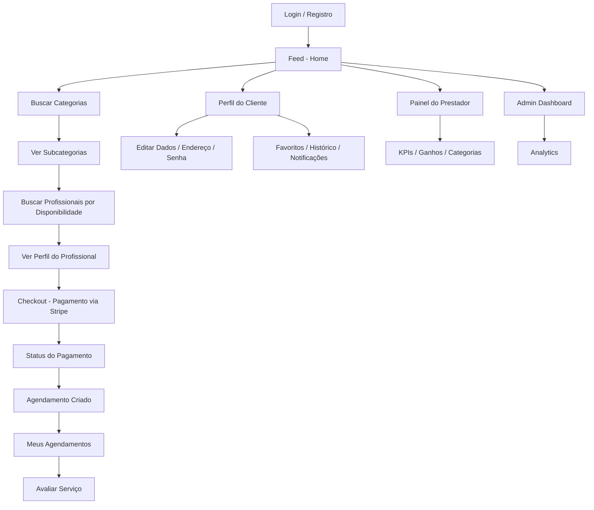

# 📋 Relatório Completo — DelBicos V2 (Front-End)

> **Projeto acadêmico** — Delivery de "bicos" (serviços temporários)
> **Versão:** 6.10.0 | **Framework:** React Native + Expo SDK 54

---

## 1. Visão Geral

O **DelBicos** é um app mobile/web de marketplace de serviços temporários. O usuário (cliente) pode buscar, contratar e pagar colaboradores (profissionais) que oferecem "bicos" — serviços como limpeza, pequenos reparos, etc.

| Aspecto | Detalhe |
|---|---|
| **Plataformas** | Android, iOS, Web |
| **Linguagem** | TypeScript (strict mode) |
| **Framework** | React Native 0.81 + Expo 54 |
| **Gerenciamento de estado** | Zustand 5 com persistência (AsyncStorage) |
| **Navegação** | React Navigation 7 (Native Stack) |
| **HTTP Client** | Axios (com interceptor de token JWT) |
| **Pagamentos** | Stripe (React Native + Web) |
| **Mapas** | React Native Maps + Google Maps API |
| **Formulários** | React Hook Form |
| **Tema** | Light / Dark / Alto Contraste (Proxy dinâmico) |
| **CI/DevOps** | Docker, Husky, ESLint, Prettier |
| **Fontes customizadas** | Afacad, Century Gothic |

---

## 2. Estrutura de Pastas

```
DelBicosV2/
├── android/                    # Build nativo Android
├── ios/                        # Build nativo iOS
├── assets/                     # Ícones e splash screen
├── docs/
│   └── CONTRIBUTING.md         # Guia de contribuição
├── scripts/
│   ├── android/                # Scripts de build gradle
│   └── block-main-commit.sh    # Proteção da branch main
├── src/
│   ├── App.tsx                 # 🟢 Componente raiz
│   ├── assets/                 # Imagens, SVGs, fontes
│   ├── components/
│   │   ├── features/           # Componentes de negócio
│   │   ├── layout/             # Layout (Header)
│   │   └── ui/                 # Componentes reutilizáveis
│   ├── config/
│   │   └── varEnvs.ts          # Variáveis de ambiente
│   ├── lib/
│   │   ├── constants/          # Constantes (mappers)
│   │   ├── helpers/            # httpClient, fileGenerator, share
│   │   ├── hooks/              # Hooks customizados
│   │   ├── stripe/             # Integração Stripe (native + web)
│   │   └── utils/              # Estilos utilitários
│   ├── screens/
│   │   ├── NavigationStack.tsx  # 🟢 Rotas do app
│   │   ├── types.ts            # Tipagem de navegação
│   │   ├── public/             # Telas acessíveis sem login
│   │   └── private/            # Telas que exigem autenticação
│   ├── stores/                 # Zustand stores (estado global)
│   ├── theme/                  # Sistema de temas
│   └── utils/                  # Analytics (GA, Clarity), notificações
├── .env                        # Variáveis de ambiente
├── app.json                    # Configuração Expo
├── Dockerfile / docker-compose # Containerização
└── package.json                # Dependências e scripts
```

---

## 3. Telas (Screens)

### 3.1 Telas Públicas (`screens/public/`)

| Tela | Rota | Descrição |
|---|---|---|
| **Login** | `/login` | Tela de login (sem header) |
| **LoginPassword** | `/login-password` | Login com e-mail e senha |
| **Feed** | `/feed` | Página principal com categorias e profissionais |
| **Register** | `/register` | Cadastro de novo usuário |
| **VerificationScreen** | — | Verificação de e-mail (recebe `email` como param) |
| **Category** | `/categories` | Lista de categorias de serviços |
| **SubCategoryScreen** | `/category/:categoryId` | Subcategorias dentro de uma categoria |
| **SearchResult** | `/search` | Resultados da busca por profissionais |
| **PartnerProfile** | `/partner/:id` | Perfil do profissional |
| **CheckoutScreen** | `/checkout` | Tela de pagamento (sem header) |
| **PaymentStatusScreen** | `/payment-status` | Status do pagamento (sucesso/falha) |
| **HelpScreen** | — | Central de ajuda |
| **NotFound** | `*` | Página 404 |

### 3.2 Telas Privadas (`screens/private/`)

| Tela | Tipo | Descrição |
|---|---|---|
| **MySchedulesScreen** | Cliente | Agendamentos do cliente |
| **ProfileScreen** | Cliente | Perfil do cliente (com abas) |
| **ProviderDashboard** | Profissional | Painel do prestador (KPIs, ganhos, categorias) |
| **BecomeProfessionalScreen** | Transição | ⚠️ Pasta vazia — ainda não implementada |
| **AdminDashboard** | Admin | Painel administrativo |
| **AdminAnalytics** | Admin | Analytics do admin |

> [!WARNING]
> A pasta `screens/private/professional/` contém apenas um arquivo `.empty`. **Não existem telas específicas para o fluxo do colaborador/profissional ainda.**

### 3.3 Abas do Perfil do Cliente (`Profile/Tabs/`)

O perfil do cliente tem **14 sub-telas** organizadas por abas:

| Aba | Funcionalidade |
|---|---|
| **DadosContaForm** | Editar dados da conta (nome, e-mail, telefone) |
| **AlterarEnderecoForm** | Gerenciar endereços |
| **TrocarSenhaForm** | Alterar senha |
| **MeusAgendamentos** | Ver agendamentos |
| **NotificacoesContent** | Notificações |
| **ConversasTab** | Conversas/chat |
| **FavoritosTab** | Profissionais favoritos |
| **AvaliacoesTab** | Avaliações feitas |
| **HistoricoCompras** | Histórico de compras |
| **PagamentosTab** | Métodos de pagamento |
| **ExportCard** | Exportar dados |
| **MenuNavegacao** | Menu lateral de navegação |
| **ProfileWrapper** | Container do perfil |
| **ProfileScreen** | Tela principal do perfil |

---

## 4. Stores (Estado Global — Zustand)

Cada store segue o padrão: `NomeStore.ts` + `types.ts` + `index.ts`

| Store | Responsabilidade | Persistido? |
|---|---|---|
| **User** | Autenticação, perfil, avatar, registro, login, logout | ✅ Sim (AsyncStorage) |
| **Address** | CRUD de endereços do usuário | ❌ |
| **Appointment** | Agendamentos, avaliações, notas fiscais | ❌ |
| **Professional** | Lista/busca de profissionais, perfil detalhado | ❌ |
| **Category** | Lista de categorias | ❌ |
| **SubCategory** | Subcategorias por categoria | ❌ |
| **Dashboard** | KPIs, ganhos, categorias (painel do prestador) | ❌ |
| **Favorite** | Profissionais favoritos | ❌ |
| **Notification** | Notificações push | ❌ |
| **Theme** | Tema ativo (light/dark/contraste) | ✅ Sim |
| **Unsplash** | Busca de imagens na API Unsplash | ❌ |
| **ViaCep** | Busca de CEP via API ViaCep | ❌ |

---

## 5. Componentes

### 5.1 Componentes de UI (`components/ui/`) — 20 componentes

Componentes genéricos e reutilizáveis:

| Componente | Uso |
|---|---|
| `Button` | Botão padrão do app |
| `CustomTextInput` | Campo de texto customizado |
| `PasswordInput` | Campo de senha com toggle de visibilidade |
| `PhoneInput` | Input com máscara de telefone |
| `CpfInput` | Input com máscara de CPF |
| `DateInput` | Seletor de data |
| `CodeInput` | Input de código de verificação |
| `CustomSelect` | Select/dropdown customizado |
| `Autocomplete` | Campo de autocompletar |
| `AddressCard` | Card de exibição de endereço |
| `ProfessionalCard` | Card de profissional |
| `ReviewCard` | Card de avaliação |
| `HighlightCard` | Card de destaque |
| `BannerStatus` | Banner de status (sucesso, erro, etc.) |
| `AccordionItem` | Item expansível (accordion) |
| `ConfirmationModal` | Modal de confirmação |
| `FeedbackModal` | Modal de feedback |
| `MapComponent` | Componente de mapa |
| `MapRenderer` | Renderizador de mapa |
| `ThemeToggle` | Toggle de tema |

### 5.2 Componentes de Features (`components/features/`) — 19 componentes

Componentes de negócio/domínio:

| Componente | Uso |
|---|---|
| `CategoryList` | Lista de categorias |
| `CategorySlider` | Slider de categorias |
| `ListProfessionals` | Lista de profissionais |
| `ProfessionalInfo` | Informações do profissional |
| `ProfessionalResultCard` | Card de resultado de busca |
| `ServiceItems` | Itens de serviço |
| `ServicesByCategoryList` | Serviços por categoria (dashboard) |
| `AppointmentCard` | Card de agendamento |
| `AppointmentItem` | Item de agendamento |
| `AppointmentDetailsModal` | Modal de detalhes do agendamento |
| `RateServiceModal` | Modal de avaliação |
| `AddressForm` | Formulário de endereço |
| `AddressSelectionModal` | Modal de seleção de endereço |
| `LocationButton` | Botão de localização |
| `PaymentInfo` | Informações de pagamento |
| `InvoiceTemplate` | Template de nota fiscal |
| `DashboardKpiCards` | Cards de KPI |
| `EarningsChart` | Gráfico de ganhos |
| `Accessibility/VLibrasSetup` | Acessibilidade (VLibras) |

### 5.3 Layout (`components/layout/`)

| Componente | Uso |
|---|---|
| `Header` | Header/navbar global do app |

---

## 6. Infraestrutura Técnica

### 6.1 HTTP Client
- **Axios** com `baseURL` configurado por variáveis de ambiente
- Interceptor automático que injeta `Authorization: Bearer <token>` em todas as requisições
- Pattern de `registerTokenProvider` para evitar import circular com Zustand

### 6.2 Sistema de Temas
- 3 temas: **Light**, **Dark**, **Alto Contraste**
- Proxy dinâmico que resolve cores sob demanda (sem re-render)
- Hook `useColors()` para componentes React
- Persistido em AsyncStorage e localStorage (web)

### 6.3 Path Aliases (TypeScript)
```
@assets/*    → src/assets/*
@components/* → src/components/*
@config/*    → src/config/*
@lib/*       → src/lib/*
@screens/*   → src/screens/*
@stores/*    → src/stores/*
@theme/*     → src/theme/*
@utils/*     → src/utils/*
```

### 6.4 Integrações Externas
| Serviço | Uso |
|---|---|
| **Stripe** | Pagamentos (com suporte nativo e web) |
| **Google Maps** | Mapas e geolocalização |
| **LocationIQ** | Geocoding alternativo |
| **Unsplash** | Imagens de banners |
| **ViaCep** | Consulta de CEP |
| **Google Analytics** | Analytics (web) |
| **Microsoft Clarity** | Heatmaps e session replay (web) |
| **VLibras** | Acessibilidade (tradução em Libras) |
| **IBGE** | Dados de estados/cidades |

### 6.5 Docker
- `Dockerfile` e `docker-compose.yml` configurados
- Rede compartilhada `delbicos-shared-network` (provavelmente para conectar com o back-end)

---

## 7. Fluxo de Negócio Atual



---

## 8. Status das Telas do Colaborador (Profissional)

> [!CAUTION]
> **As telas do colaborador/profissional ainda NÃO foram implementadas.**

### O que já existe:
- ✅ **Store `Professional`** com tipos e endpoints de busca
- ✅ **Store `Dashboard`** com KPIs, ganhos e categorias
- ✅ **Tela `ProviderDashboard`** — Painel básico do prestador
- ✅ **Tipos de dados** do profissional (id, cpf, cnpj, descrição, serviços, avaliações)
- ✅ **Componentes** como `DashboardKpiCards`, `EarningsChart`, `ServicesByCategoryList`

### O que falta (para as telas do colaborador):
- ❌ **Pasta `screens/private/professional/`** está vazia (apenas `.empty`)
- ❌ **Tela de "Tornar-se Profissional"** (`BecomeProfessionalScreen`) está vazia
- ❌ **Gerenciamento de serviços** (CRUD de serviços do profissional)
- ❌ **Agenda do profissional** (ver e gerenciar agendamentos recebidos)
- ❌ **Aceitar/Recusar agendamentos**
- ❌ **Chat/Conversa com clientes**
- ❌ **Perfil editável do profissional** (descrição, CNPJ, endereço)
- ❌ **Tela de avaliações recebidas**
- ❌ **Configurações de disponibilidade**

---

## 9. Endpoints da API (inferidos pelo front-end)

| Método | Endpoint | Store |
|---|---|---|
| POST | `/auth/register` | User |
| POST | `/auth/resend` | User |
| POST | `/api/user/login` | User |
| POST | `/api/admin/login` | User |
| GET | `/api/user/me` | User |
| PUT | `/api/user/me` | User |
| POST | `/api/user/change-password` | User |
| POST | `/api/user/imgbb/avatar` | User |
| DELETE | `/api/user/avatar` | User |
| GET | `/api/professionals` | Professional |
| GET | `/api/professionals/:id` | Professional |
| GET | `/api/appointments` | Appointment |
| POST | `/api/appointments/:id/review` | Appointment |
| GET | `/api/categories` | Category |
| GET | `/api/subcategories` | SubCategory |
| GET | `/api/dashboard/kpis` | Dashboard |
| GET | `/api/dashboard/earnings` | Dashboard |
| GET | `/api/dashboard/categories` | Dashboard |
| GET/POST/DELETE | `/api/addresses` | Address |
| GET/POST/DELETE | `/api/favorites` | Favorite |

---

## 10. Resumo e Próximos Passos

### ✅ O que está sólido:
1. Arquitetura bem organizada com separação clara de responsabilidades
2. Sistema de temas completo (light/dark/contraste)
3. Fluxo completo do **cliente** (buscar → contratar → pagar → avaliar)
4. Integração Stripe para pagamentos
5. Painel administrativo
6. Docker configurado para dev
7. Acessibilidade com VLibras

### ⚠️ O que precisa ser feito para as telas do colaborador:
1. **Criar as telas** em `screens/private/professional/`
2. **Implementar `BecomeProfessionalScreen`** — formulário de cadastro como profissional
3. **Tela de gerenciamento de serviços** — CRUD
4. **Tela de agenda/agendamentos recebidos** — aceitar/recusar
5. **Tela de perfil editável do profissional**
6. **Tela de avaliações recebidas**
7. **Adicionar as rotas** no `NavigationStack.tsx`
8. **Criar/expandir stores** para suportar ações do profissional

> [!TIP]
> O padrão do projeto está muito bem definido. Para criar as telas do colaborador, basta seguir a mesma estrutura: criar pasta em `screens/private/professional/`, adicionar store se necessário, registrar a rota em `NavigationStack.tsx`, e usar os componentes de UI existentes.
